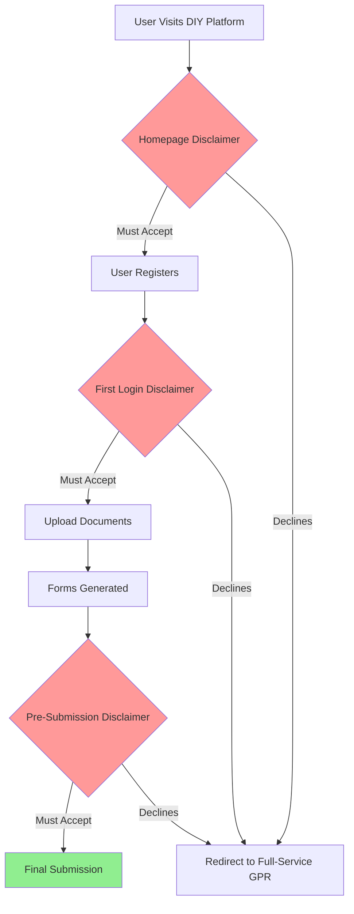
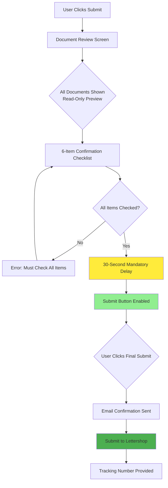
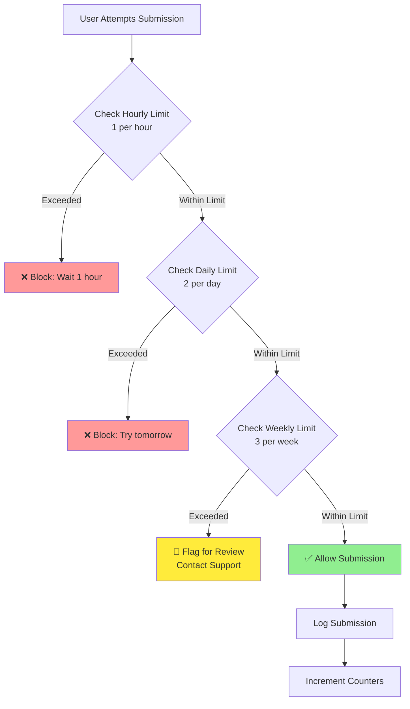
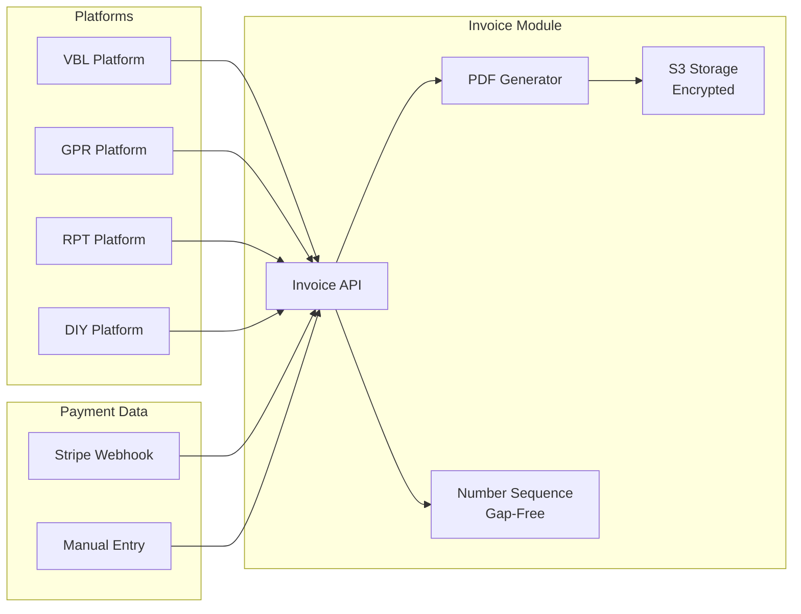
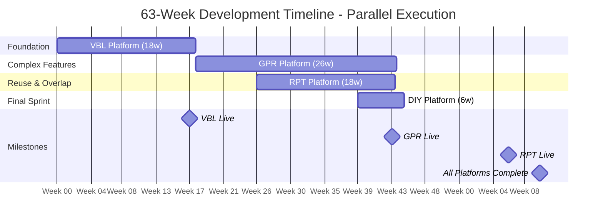
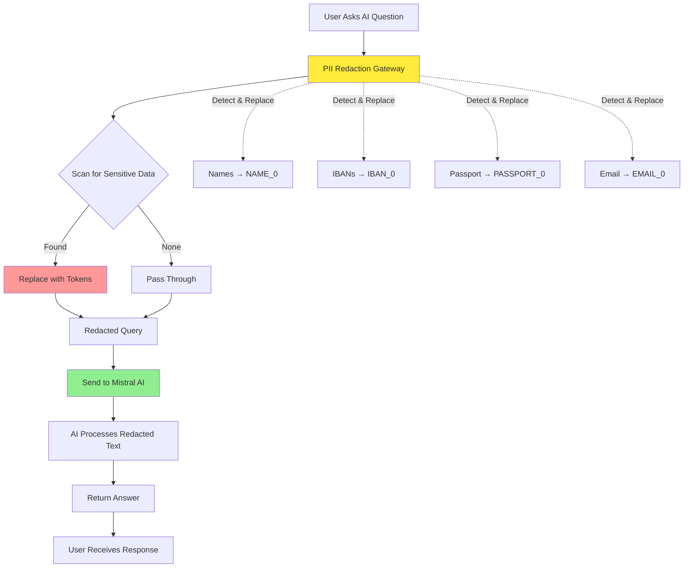
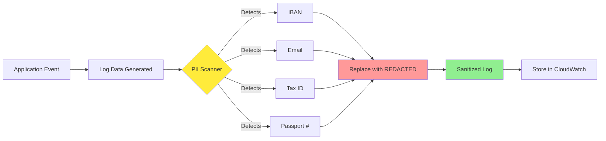
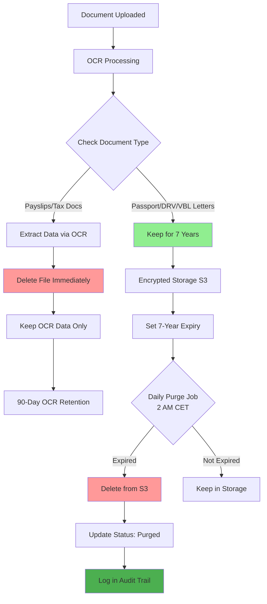

# Unified Development Proposal
## VBL + GPR + RPT + GPR DIY - Four Platforms with Shared Backend Architecture

**Client:** ATLAES GmbH
**Developer:** Karl Kenneth - Senior Full Stack Developer
**Date:** October 2, 2025
**Proposal Reference:** UNIFIED-4P-2025-001
**Valid Until:** November 2, 2025

---

## Executive Summary

This proposal outlines a unified development approach for **four interconnected German pension refund platforms**, leveraging a shared backend architecture to maximize code reuse, minimize costs, and accelerate time-to-market.

### The Four Platforms

| Platform | Target Market | Revenue Model | Complexity |
|----------|---------------|---------------|------------|
| **VBLrefund.com** | Former German public service employees | €89 per year worked + VAT | Foundation |
| **GermanyPensionRefund.com** | Non-EU citizens claiming state pensions | 9.75% success-based fee + escrow | High |
| **ATLAES Retirement Platform (RPT)** | Elderly Germans abroad (66+ years) | Pension administration services | Moderate |
| **GPR DIY Claims** | Self-service pension claims | Lower upfront fee (€49-89) | Low-Moderate |

### Unified Backend Advantage

**Traditional Approach (4 Separate Backends):**
- 4 separate codebases to maintain
- Bug fixes × 4
- Security updates × 4
- Infrastructure costs × 4
- Total Cost: ~$155,000

**Unified Approach (1 Backend + 4 Frontends):**
- Single codebase with platform-specific modules
- Bug fix once, fixes all platforms
- Shared infrastructure
- 70-85% code reuse across platforms
- **Total Cost: $67,200**

### Investment Summary

| Platform | Development Cost | Timeline | Code Reuse |
|----------|-----------------|----------|------------|
| **VBL** | $16,000 | 18 weeks | Foundation (100% new) |
| **GPR** | $27,200 | 26 weeks | 40-50% from VBL |
| **RPT** | $18,000 | 18 weeks | 60-70% from VBL/GPR |
| **GPR DIY** | $6,000 | 6 weeks | 85% from VBL/GPR |
| **Total** | **$67,200** | **63 weeks** | **Average 60%** |

**Savings vs Separate Development:**
- Initial: $87,800 (57% reduction)
- Annual Maintenance: $9,600/year (60% reduction)
- 5-Year Total: **$135,800 savings**

### Value Additions

At $67,200 investment, you receive:
- ✅ Complete knowledge transfer documentation
- ✅ Unified admin dashboard for all 4 platforms
- ✅ Single sign-on (SSO) for users across platforms
- ✅ Document sharing across platforms (upload passport once, use everywhere)
- ✅ Shared signature system (draw once, use for all forms)
- ✅ AI chat assistant (Mistral AI - GDPR compliant)
- ✅ 3-month bug fix warranty
- ✅ 2 weeks post-launch support per platform

---

## Table of Contents

1. [Platform Overview](#1-platform-overview)
2. [Unified Backend Architecture](#2-unified-backend-architecture)
3. [Platform-Specific Features](#3-platform-specific-features)
4. [Code Reuse Analysis](#4-code-reuse-analysis)
5. [Development Pricing](#5-development-pricing)
6. [Implementation Timeline](#6-implementation-timeline)
7. [Technology Stack](#7-technology-stack)
8. [AI Privacy & GDPR Compliance](#8-ai-privacy--gdpr-compliance)
9. [Signature Implementation](#9-signature-implementation)
10. [Quality Assurance](#10-quality-assurance)
11. [Maintenance & Support](#11-maintenance--support)
12. [Terms & Conditions](#12-terms--conditions)

---

## 1. Platform Overview

### 1.1 VBLrefund.com - Foundation Platform

**Target Users:** Former German public service employees
**Problem:** Complex bureaucracy for VBL pension refunds
**Solution:** Automated eligibility check + document submission
**Fee Model:** €89 per year worked + VAT (upfront payment)

**Key Features:**
- Eligibility calculator (pre/post-2018 rules)
- Document upload & OCR processing
- Hand-drawn signature capture (matching passport)
- Lettershop API integration (print & mail)
- Payment via Stripe
- Admin dashboard

**Development:** $16,000 | 400 hours | 18 weeks

---

### 1.2 GermanyPensionRefund.com - Full-Service Platform

**Target Users:** Non-EU citizens outside EU/UK after 24 months
**Problem:** Complex DRV forms, 8-week processing time
**Solution:** AI-assisted document prep + law firm collaboration
**Fee Model:** 9.75% success-based fee with escrow

**Key Features:**
- Complex DRV/SSA calculator
- 8+ document types with advanced OCR
- **Law firm portal** (case management, document downloads)
- Escrow payment system (9.75% fee calculation)
- **Mistral AI chat assistant** (GDPR compliant)
- Multi-currency support (Wise API)
- Mail automation & classification
- 12-step workflow

**Development:** $27,200 | 680 hours | 26 weeks

---

### 1.3 ATLAES Retirement Platform (RPT) - Elderly-Focused Platform

**Target Users:** Elderly Germans abroad (66+ years), non-Germans with EU contributions
**Problem:** Low tech skills, language barriers, complex pension claims
**Solution:** Elderly-accessible interface + multi-language support
**Fee Model:** Pension administration services

**Key Features:**
- **Elderly-accessible UI** (large buttons, high contrast, WCAG 2.1 AA)
- Multi-language (German/English)
- DRV form generation (R0100, Lebensbescheinigung, A1313, V0800)
- Incoming correspondence automation
- EUR account provisioning (payment provider)
- **Mistral AI chat assistant** (adapted for elderly users)
- **Law firm portal** (reused from GPR)
- Tutorial system (videos, illustrated guides)
- Dual intake (digital + postal fallback)

**Development:** $18,000 | 450 hours | 18 weeks

---

### 1.4 GPR DIY Claims - Self-Service Platform

**Target Users:** Self-sufficient users who want to save on fees
**Problem:** Users confident to handle own submission want lower costs
**Solution:** Self-service claim with automated form generation
**Fee Model:** Lower upfront fee (€49-89, no success-based fee)

**Key Features:**
- Eligibility calculator (reused from GPR)
- Document upload & OCR (reused from GPR)
- DRV form generation (reused from GPR)
- **Hand-drawn signature** (reused from VBL - matching passport)
- Lettershop API submission (reused from VBL)
- Status tracking dashboard
- Simplified workflow (no law firm, no escrow)

**Development:** $6,000 | 150 hours | 6 weeks

**Why it's affordable:**
- 85% code reuse from VBL + GPR
- No new signature system (uses VBL's)
- No e-signature service costs
- Simplified workflow (8 states vs GPR's 12)

---

## 2. Unified Backend Architecture

### 2.1 High-Level Architecture

**Unified Backend Strategy:** One powerful backend serves all 4 platforms, maximizing code reuse and minimizing costs.

```mermaid
graph TB
    subgraph Frontends["🌐 Platform Frontends (Next.js)"]
        VBL[VBL Frontend<br/>VBLrefund.com]
        GPR[GPR Frontend<br/>GermanyPensionRefund.com]
        RPT[RPT Frontend<br/>ATLAES Retirement]
        DIY[DIY Frontend<br/>GPR DIY Claims]
    end

    subgraph Backend["⚙️ Unified Backend (Hono.js)"]
        subgraph Shared["Shared Services - Reused by All"]
            AUTH[🔐 Authentication]
            USER[👥 User Management]
            DOC[📄 Document Store]
            OCR[🔍 OCR Engine]
            SIG[✍️ Signature System<br/>⭐ Reused Everywhere]
            PAY[💳 Payment System]
            NOTIF[📧 Notifications]
            AI[🤖 Mistral AI Chat<br/>⭐ GDPR Compliant]
            GDPR[🔒 GDPR Compliance]
            LAWFIRM[⚖️ Law Firm Portal<br/>⭐ GPR + RPT]
        end

        subgraph Modules["Platform-Specific Modules"]
            VBLCALC[VBL Calculator]
            VBLMAIL[VBL Lettershop]
            GPRCALC[GPR Calculator]
            GPRESCROW[GPR Escrow]
            RPTFORMS[RPT DRV Forms]
            DIYWORK[DIY Workflow ⭐ NEW]
        end

        subgraph Data["Data Layer"]
            POSTGRES[(PostgreSQL<br/>EU Frankfurt)]
            REDIS[(Redis Cache)]
            S3[(S3 Storage<br/>Encrypted)]
        end
    end

    VBL --> Backend
    GPR --> Backend
    RPT --> Backend
    DIY --> Backend

    Shared --> Modules
    Modules --> Data

    style SIG fill:#90EE90
    style AI fill:#90EE90
    style LAWFIRM fill:#90EE90
    style DIYWORK fill:#ffeb3b
    style Backend fill:#e3f2fd
```



### 2.2 Shared Services (70-85% Reuse)

| Service | Used By | Reusability | Notes |
|---------|---------|-------------|-------|
| **Authentication** | All 4 | 95% | OAuth2, magic links, JWT |
| **User Management** | All 4 | 90% | Registration, profiles, roles |
| **Document Management** | All 4 | 90% | Upload, storage, S3 integration |
| **OCR Engine** | All 4 | 85% | AWS Textract, field extraction |
| **Signature System** | All 4 | 95% | Hand-drawn, passport matching |
| **Payment Processing** | All 4 | 75% | Stripe, invoicing, webhooks |
| **Notification Service** | All 4 | 95% | Email, SMS, in-app |
| **Mistral AI Chat** | GPR, RPT, DIY | 80% | GDPR-compliant AI assistant |
| **GDPR Compliance** | All 4 | 98% | Consent, export, deletion |
| **Admin Dashboard** | All 4 | 85% | User mgmt, analytics |
| **Law Firm Portal** | GPR, RPT | 90% | Case queue, downloads |
| **Lettershop API** | VBL, DIY | 85% | Print & mail submission |

### 2.3 Platform-Specific Modules

**VBL Module (360h core + 40h buffer):**
- VBL-specific calculator
- Lettershop integration
- Fixed fee payment
- 5-step workflow

**GPR Module (600h core + 80h buffer):**
- Complex DRV/SSA calculator
- Escrow system
- Law firm portal (built once)
- Mistral AI integration
- Multi-currency
- 12-step workflow

**RPT Module (400h core + 50h buffer):**
- Elderly-accessible UI
- DRV form generation
- Correspondence automation
- EUR account provisioning
- Multi-language routing
- 10-step workflow

**GPR DIY Module (135h core + 15h buffer):**
- Simplified workflow (8 states)
- Status tracking dashboard
- Lettershop adaptation
- Self-service UI
- No law firm, no escrow

---

## 3. Platform-Specific Features

### 3.1 VBLrefund.com

**Core Functionality:**
- Eligibility calculator (pre/post-2018 rules)
- Document upload (passport, payslip, VBL letter)
- OCR extraction with manual correction
- **Hand-drawn signature capture** (matches passport signature)
- Payment: €89/year worked + VAT
- Lettershop API submission
- Tracking & status updates

**Workflow (5 Steps):**
1. Draft
2. Ready to Submit
3. Submitted to Lettershop
4. Printed
5. Dispatched

---

### 3.2 GermanyPensionRefund.com

**Core Functionality:**
- Complex DRV/SSA calculator (§210 SGB VI)
- 8+ document types (passport, DRV letters, deregistration, etc.)
- Advanced OCR with confidence scoring
- **Law Firm Portal** (built once, reused in RPT)
- Escrow payment (9.75% success fee)
- **Mistral AI chat assistant** (GDPR compliant)
- Multi-currency (Wise API)
- Mail automation & classification

**Workflow (12 Steps):**
1. Account Created
2. Documents Uploaded
3. OCR Processing
4. User Verification
5. Certificate of Life
6. Document Pack Generated
7. Ready for Law Firm
8. Submitted to DRV
9. In Review
10. Decision Received
11. Escrow Calculated
12. Payment Released

---

### 3.3 ATLAES Retirement Platform (RPT)

**Core Functionality:**
- **Elderly-accessible interface** (WCAG 2.1 AA)
- Multi-language (German/English)
- DRV form generation (R0100, Lebensbescheinigung, A1313, V0800)
- Incoming correspondence automation
- EUR account provisioning
- **Mistral AI chat** (elderly-friendly)
- **Law firm portal** (reused from GPR)
- Tutorial system (videos, guides)
- Dual intake (digital + postal)

**Workflow (10 Steps):**
1. Account Created
2. Documents Uploaded
3. OCR Processing Complete
4. User Verification
5. DRV Forms Generated
6. Notarization Complete
7. Ready for Law Firm
8. Submitted to DRV
9. Decision Received
10. Payment Processed

---

### 3.4 GPR DIY Claims (NEW)

**Core Functionality:**
- Eligibility calculator (reused from GPR 100%)
- Document upload & OCR (reused from GPR 85%)
- DRV form generation (reused from GPR 90%)
- **Hand-drawn signature** (reused from VBL 100%)
- Lettershop submission (reused from VBL 85%)
- Status tracking dashboard (NEW)
- Self-service workflow (NEW)

**Workflow (8 Steps):**
1. Documents Uploaded
2. OCR Processing
3. User Verification
4. Forms Generated
5. User Reviews Forms
6. Signature Captured
7. Submitted to Lettershop
8. In Transit to DRV

**Key Differences from GPR:**
- ❌ No law firm portal
- ❌ No escrow system
- ❌ No AI chat (optional)
- ✅ Lower fee (€49-89 vs 9.75% success fee)
- ✅ Faster process (no law firm queue)
- ✅ User has full control

### 3.5 GPR DIY Platform Safeguards

**Critical Protections for Self-Service Platform:**

#### 1. Legal Disclaimers (Not Legal Advice)

**Protection Strategy:** Multi-touchpoint legal notices ensure users understand this is a self-service tool, not legal advice.

**User Journey with Disclaimer Checkpoints:**



**What Users See at Each Checkpoint:**

| Checkpoint | Disclaimer Message | Action Required |
|------------|-------------------|-----------------|
| **Homepage** | ⚠️ "This is a DIY tool for form preparation, NOT legal advice" | ✅ Accept to continue |
| **First Login** | "We help prepare forms but don't review legal eligibility or guarantee approval" | ✅ Accept to proceed |
| **Before Upload** | Reminder displayed (footer on every page) | 🔍 Visual reminder only |
| **Final Submission** | "You are solely responsible for accuracy. This is DIY, no legal representation" | ✅ Must accept to submit |

**Key Protections:**
- ❌ We do NOT provide legal advice
- ❌ We do NOT guarantee claim approval
- ❌ We do NOT offer legal representation
- ✅ We DO help prepare and submit forms
- ✅ Users can upgrade to full-service GPR with law firm support

#### 2. Final Confirmation Step Before Lettershop Submission

**Protection Strategy:** Multi-step verification process prevents accidental submissions and ensures user awareness.

**Submission Confirmation Flow:**



**6-Item Confirmation Checklist:**

| # | Confirmation Required | Why It Matters |
|---|----------------------|----------------|
| 1️⃣ | "I have reviewed all generated DRV forms" | Ensures user has seen final documents |
| 2️⃣ | "All information is accurate and complete" | User validates data accuracy |
| 3️⃣ | "My signature matches my passport" | Prevents DRV rejection |
| 4️⃣ | "I understand this is DIY (no legal advice)" | Legal protection |
| 5️⃣ | "I accept full responsibility for submission" | User accountability |
| 6️⃣ | "Service fee is non-refundable" | Financial clarity |

**Submission Protection Features:**
- 🔍 **Read-only preview:** User sees exactly what will be submitted
- ⏱️ **30-second delay:** Prevents impulsive clicks, forces review time
- 🔴 **Prominent final button:** Clear, red "I Confirm and Submit to DRV" button
- ✉️ **Email confirmation:** Immediate receipt with submission details and tracking

#### 3. Rate-Limiting to Prevent Accidental/Bulk Submissions

**Protection Strategy:** Multi-layer submission limits prevent system abuse and accidental duplicate submissions.

**Rate Limiting Decision Flow:**



**Rate Limit Policy:**

| Action Type | Hourly | Daily | Weekly | Why This Limit? |
|-------------|--------|-------|--------|-----------------|
| **Document Upload** | 20 files | 50 files | - | Prevents spam, allows normal workflow |
| **Form Generation** | 5 times | 10 times | - | Prevents excessive system load |
| **Final Submission** | **1 time** | **2 times** | **3 times** | **Prevents accidental duplicates** |

**User Experience When Limit Reached:**

📧 **Friendly Error Message:**
> "You've reached the submission limit (1 per hour).
>
> This protects you from accidental duplicates and ensures careful review.
>
> ⏰ You can submit again in: **45 minutes**
>
> Need urgent help? Contact support@germanpensionrefund.com"

**Anti-Abuse Safeguards:**
- ✅ Email confirmation before each submission
- ✅ CAPTCHA on final button
- ✅ Duplicate document detection (blocks identical submissions)
- 🚨 Automatic review flag (>3 submissions/week triggers manual check)

**DIY Safeguards Summary:**

| Safeguard | Implementation | Prevents | User Impact |
|-----------|----------------|----------|-------------|
| **Legal Disclaimers** | Multi-touchpoint acceptance | Legal liability, user confusion | ⚠️ Minor (one-time acceptance) |
| **Final Confirmation** | 6-item checklist + 30s delay | Accidental submissions, incomplete reviews | ⚠️ Minor (30-second wait) |
| **Rate Limiting** | 1/hour, 2/day, 3/week | Bulk abuse, duplicate submissions | ✅ Minimal (normal users unaffected) |

**Cost:** All safeguards included in base DIY development (no additional charge)

---

### 3.6 Unified Invoice Generation Module (NEW)

**Purpose:** Centralized invoice generation for all 4 platforms with German tax compliance

**Core Functionality:**
- **Unified Invoice System** for VBL, GPR, RPT, and DIY platforms
- Sequential invoice numbering (GDPR-compliant, gap-free)
- German VAT calculation (19% standard, 7% reduced)
- Multi-currency support (EUR, USD, GBP)
- PDF generation with ATLAES branding
- Automatic email delivery via SendGrid
- 7-year retention policy (German tax law)

**Technical Architecture:**


**Invoice Features:**
- **Header:** ATLAES logo, company details, tax ID
- **Customer Section:** Name, address, VAT ID (if applicable)
- **Line Items:** Service description, quantity, amount
- **Tax Calculation:** Automatic VAT based on customer location
- **Footer:** Payment terms, bank details, legal notices

**API Endpoints:**
```typescript
// Generate invoice for any platform
POST /api/invoices/generate
{
  platform: 'vbl' | 'gpr' | 'rpt' | 'diy',
  customer: {...},
  items: [...],
  payment: {...}
}

// Retrieve invoice
GET /api/invoices/{invoiceNumber}

// List invoices with filtering
GET /api/invoices?platform=vbl&year=2025

// Download PDF
GET /api/invoices/{invoiceNumber}/pdf
```

**Compliance Features:**
- ✅ GoBD-compliant (German digital bookkeeping standards)
- ✅ Sequential numbering without gaps
- ✅ Immutable storage (no editing after generation)
- ✅ Audit trail for all invoice events
- ✅ Reverse charge for B2B EU transactions
- ✅ Automatic exchange rate documentation

**Future Extensibility:**
- API designed for external platform access
- ExitDE or other platforms can integrate later via secure API key
- Rate limiting and authentication ready for external consumers
- Webhook support for real-time invoice events

**Development:** 40 hours (included in shared backend - no additional cost)

---

### 3.7 ATLAES.de Business Card Website (NEW)

**Purpose:** Professional corporate presence and service directory

**Simple Static Website:**
```
ATLAES.de
├── Single-Page Layout
│   ├── Hero Section
│   │   ├── ATLAES Logo
│   │   └── Tagline: "German Pension Solutions"
│   ├── About Section (2 paragraphs)
│   ├── Services Grid
│   │   ├── [Card] GermanyPensionRefund.com
│   │   ├── [Card] VBLrefund.com
│   │   ├── [Card] ATLAES Retirement Platform
│   │   └── [Card] GPR DIY Claims
│   └── Contact Section
│       ├── Email: info@atlaes.de
│       └── Phone: +49 xxx xxxx
├── Footer
│   ├── Impressum (Legal requirement)
│   ├── Datenschutz (Privacy)
│   └── © 2025 ATLAES GmbH
```

**Features:**
- Mobile-responsive design
- Fast loading (static HTML/CSS)
- SEO optimized
- SSL certificate
- Cookie consent banner
- Hosted on S3 + CloudFront

**Development:** 20 hours (included via buffer hours - no additional cost)

---

## 4. Code Reuse Analysis

### 4.1 Complete Reuse Breakdown

#### VBL Platform (Foundation)
- **Total:** $16,000 (400 hours)
- **Reuse from previous:** 0% (builds foundation)
- **Builds for others:** Signature system, lettershop, auth, documents

**What VBL Establishes:**
- Authentication system (OAuth, magic links)
- User management & profiles
- Document upload infrastructure
- OCR framework (AWS Textract)
- **Hand-drawn signature system** ⭐
- Payment processing (Stripe)
- Email notifications
- Admin dashboard
- GDPR compliance
- **Lettershop API integration** ⭐

#### GPR Platform (Advanced Features)
- **Total:** $27,200 (680 hours)
- **Reuse from VBL:** 40-50% ($10,880-13,600 savings)
- **Builds for others:** Law firm portal, Mistral AI

**What GPR Adds:**
- Complex DRV/SSA calculator
- **Law firm portal** ($8,000) ⭐ Reused by RPT
- **Mistral AI chat** ($5,000) ⭐ Reused by RPT
- Escrow system
- Multi-currency (Wise API)
- Mail automation
- Advanced OCR (8+ document types)

**What GPR Reuses from VBL:**
- Authentication (90%)
- User management (85%)
- Document upload (80%)
- Signature system (100%) ⭐
- Payment base (50%)
- Notifications (90%)
- Admin framework (70%)

#### RPT Platform (Elderly-Focused)
- **Total:** $18,000 (450 hours)
- **Reuse from VBL/GPR:** 60-70% ($16,200-18,900 savings)

**What RPT Adds (NEW):**
- Elderly-accessible UI ($2,500)
- Tutorial system ($1,200)
- DRV form generation ($1,500)
- Correspondence automation ($2,500)
- EUR account integration ($1,500)
- Multi-language routing ($800)

**What RPT Reuses:**
- Authentication (90% from VBL)
- User management (85% from VBL)
- Document upload (85% from VBL)
- **Signature system (100% from VBL)** ⭐
- OCR (80% from GPR)
- **Law firm portal (90% from GPR)** ⭐ $6,000 saved
- **Mistral AI (80% from GPR)** ⭐ $4,000 saved
- Payment (70% from VBL/GPR)
- Notifications (90% from VBL)

#### GPR DIY Platform (Self-Service)
- **Total:** $6,000 (150 hours)
- **Reuse from VBL/GPR:** 85% ($16,200 savings)

**What DIY Adds (NEW - 135h):**
- Status tracking dashboard (30h)
- DIY workflow engine (40h)
- Lettershop adaptation for DRV (20h)
- Self-service UI (25h)
- Testing & documentation (20h)

**What DIY Reuses:**
- Authentication (95% from VBL)
- User management (95% from VBL)
- Document upload (90% from GPR)
- OCR processing (90% from GPR)
- **GPR calculator (100% from GPR)** ⭐
- **DRV form generation (90% from GPR)** ⭐
- **Signature system (100% from VBL)** ⭐ No DocuSeal needed!
- **Lettershop API (85% from VBL)** ⭐
- Payment (80% from VBL)
- Notifications (95% from VBL)

### 4.2 Total Savings vs Standalone Development

| Platform | Standalone Cost | Unified Cost | Savings |
|----------|----------------|--------------|---------|
| VBL | $25,000 | $16,000 | $9,000 (36%) |
| GPR | $50,000 | $27,200 | $22,800 (46%) |
| RPT | $45,000 | $18,000 | $27,000 (60%) |
| GPR DIY | $22,200 | $6,000 | $16,200 (73%) |
| **Total** | **$142,200** | **$67,200** | **$75,000 (53%)** |

---

## 5. Development Pricing

### 5.1 Final Pricing Structure

**All 4 Platforms - $67,200 Total**

| Platform | Hours | Breakdown | Cost |
|----------|-------|-----------|------|
| **VBL** | 400 | 360h dev + 40h testing | $16,000 |
| **GPR** | 680 | 600h dev + 80h testing | $27,200 |
| **RPT** | 450 | 400h dev + 50h testing | $18,000 |
| **GPR DIY** | 150 | 135h dev + 15h testing | $6,000 |
| **Total** | **1,680** | **@$40/hr** | **$67,200** |

### 5.2 Why This Pricing Is Fair

1. **Massive Code Reuse:**
   - VBL builds foundation (0% reuse)
   - GPR reuses 40-50% from VBL
   - RPT reuses 60-70% from VBL/GPR
   - DIY reuses 85% from VBL/GPR

2. **Shared Components Built Once:**
   - Law firm portal: Built in GPR ($8k), reused in RPT ($0)
   - Signature system: Built in VBL ($2k), reused in all ($0)
   - Mistral AI: Built in GPR ($5k), reused in RPT ($0)
   - Lettershop: Built in VBL ($3k), reused in DIY ($0)

3. **Market-Aligned Rate:**
   - $40/hour (PH market rate for quality work)
   - Includes PM, QA, documentation, warranty

4. **Honest Buffer Included:**
   - 10-13% testing buffer per platform
   - Realistic for quality delivery

### 5.3 What $67,200 Includes (Final Amendment - October 2025)

✅ **Core Development:**
- Complete source code (ownership upon final payment)
- 4 full-featured platforms (VBL, GPR, RPT, DIY)
- Unified backend architecture
- All integrations (Stripe, AWS, Mistral, Wise, Lettershop)
- Technical documentation
- API documentation
- Database schema documentation

✅ **NEW Additions (Included via Buffer Hours):**
- **Unified Invoice Module** (all 4 platforms)
  - PDF generation with VAT calculation
  - Sequential numbering system
  - 7-year retention compliance
  - Multi-currency support
- **ATLAES.de Business Card Website**
  - Simple static landing page
  - Links to all 4 services
  - Impressum & Privacy Policy
  - Professional credibility

✅ **Development Infrastructure:**
- GitHub Organization setup (ATLAES GmbH)
- Private repositories for all platforms
- CI/CD pipelines with GitHub Actions
- SST (Serverless Stack) infrastructure as code
- Automated testing workflows

✅ **Quality Assurance:**
- >80% test coverage
- Security audit (OWASP Top 10)
- Performance optimization
- Accessibility compliance (WCAG 2.1 AA for RPT)
- GDPR compliance verification

✅ **Training & Support:**
- 3-month bug fix warranty (per platform)
- 2 weeks post-launch support (per platform)
- Training sessions (recorded):
  - Admin training (4 hours)
  - Law firm training (3 hours)
  - CMS training (2 hours)
  - Technical handover (2 hours)
- Knowledge transfer documentation

✅ **Bonus Features:**
- Unified admin dashboard (manage all 4 platforms)
- Single sign-on (SSO) for users
- Document sharing across platforms
- Signature reuse across platforms
- Cross-platform analytics
- Centralized GDPR tools

### 5.4 Payment Schedule

**Milestone-Based Payments:**

| Payment | Milestone | Amount | Timing | Deliverables |
|---------|-----------|--------|--------|--------------|
| **1** | Project Initiation | $13,440 (20%) | Contract signing | Kickoff, infrastructure setup |
| **2** | VBL Complete | $13,440 (20%) | Week 18 | VBL live, tested, foundation established |
| **3** | GPR Complete | $20,160 (30%) | Week 44 | GPR live, law firm portal operational |
| **4** | RPT + DIY Complete | $13,440 (20%) | Week 63 | All 4 platforms operational, tested |
| **5** | Final Acceptance | $6,720 (10%) | Post-UAT | Production deployment, training complete |


### 5.5 What's NOT Included (Separate/Future)

❌ **Future Services:**
- Migration to Hetzner/Scaleway (€8,000-12,000 when needed)
- ExitDE platform (separate team/project)
- Major feature additions beyond scope
- Regulatory compliance updates (beyond patches)

❌ **Separate Maintenance Contract (After Warranty):**
- **Separate agreement** from development contract
- Starts after 3-month warranty period ends (per platform)
- **Monthly rolling contract** (not annual commitment)
  - $700/month for 20 hours
  - $35/hour for additional work
  - 30-day cancellation notice
  - Cancel anytime to end of month
- Third-party service subscriptions (see below)

### 5.6 Third-Party Service Costs (Client Responsibility)

**Development Tools:**
- **GitHub Organization** (ATLAES GmbH): $20/month (5 seats @ $4/user)
- Private repositories for all platforms
- CI/CD with GitHub Actions included
- Code reviews & branch protection

**Monthly Recurring:**
- Mistral AI (GPR, RPT, DIY): €10-30/month (~$12-35)
- AWS hosting (all 4 platforms): $400-600/month
- Lettershop API: €3-5 per submission (pay-per-use)
- SendGrid (email): ~$20/month
- Sentry (error tracking): ~$26/month

**One-Time:**
- Domain registration: ~$50/year × 5 domains (includes ATLAES.de)
- SSL certificates: Free (Let's Encrypt)

**NOT Needed:**
- ~~DocuSign/HelloSign~~ (using hand-drawn signature)
- ~~Additional e-signature service~~

---

## 6. Implementation Timeline

### 6.1 Optimized Parallel Development (63 Weeks Total)

**Recommended Approach: Efficient Overlap Strategy**



**Development Phases:**

| Phase | Platform | Start Week | Duration | Overlap Strategy |
|-------|----------|------------|----------|------------------|
| **1** | VBL (Foundation) | W1 | 18 weeks | Full focus - builds foundation |
| **2** | GPR (Complex) | W19 | 26 weeks | Overlaps with RPT in final weeks |
| **3** | RPT (Elderly) | W27 | 18 weeks | Starts during GPR testing phase |
| **4** | DIY (Self-Service) | W57 | 6 weeks | Starts during RPT final testing |

**Phase 1: VBL (Weeks 1-18)**
- Builds foundation for all platforms
- Establishes signature system (reused by all)
- Lettershop integration (reused by DIY)
- Testing on simpler use case first

**Phase 2: GPR (Weeks 19-44)**
- Complex features (calculator, escrow, law firm portal)
- Mistral AI integration (reused by RPT)
- Law firm portal (reused by RPT)
- Advanced OCR (reused by RPT, DIY)
- **Optimized from 30 weeks to 26 weeks** (efficiency gains)

**Phase 3: RPT (Weeks 27-62)**
- **Starts Week 27** (during GPR testing phase)
- Leverages VBL + GPR foundation
- Maximum code reuse (60-70%)
- Elderly UX customization
- Correspondence automation
- **Optimized from 20 weeks to 18 weeks**

**Phase 4: GPR DIY (Weeks 57-63)**
- **Starts Week 57** (during RPT final testing)
- Fastest development (85% reuse)
- Lightweight self-service workflow
- **Optimized from 8 weeks to 6 weeks**

**Total Duration: 63 weeks (~14.5 months)**

### 6.2 How We Achieve 63 Weeks at Same Cost

**Time Savings Breakdown:**

1. **VBL → GPR Transition (Save 2 weeks)**
   - Immediate start after VBL deployment
   - No waiting period
   - Infrastructure reuse speeds up setup

2. **GPR → RPT Overlap (Save 8 weeks)**
   - Week 27: Start RPT while GPR enters testing phase
   - GPR testing (Weeks 40-44) runs parallel to RPT development
   - Shared components (law firm portal, AI) already built

3. **RPT → DIY Overlap (Save 2 weeks)**
   - Week 57: Start DIY while RPT in final testing
   - DIY leverages 85% reuse (faster than estimated)
   - Reduced from 8 weeks to 6 weeks

4. **Optimized Development (Save 1 week)**
   - Shared test suites across platforms
   - Automated regression testing
   - Parallel UAT sessions
   - CI/CD automation

**Total Saved: 13 weeks (76 → 63)**

**How Same Cost is Maintained:**

✅ **Efficient Task Switching:**
- Development overlaps only during low-intensity testing phases
- GPR testing (Weeks 40-44): Allows RPT development focus
- RPT testing (Weeks 60-62): Allows DIY development focus
- No additional developer needed

✅ **Maximized Code Reuse:**
- Law firm portal built in GPR → immediately available for RPT ($0 rebuild)
- Mistral AI integration built in GPR → immediately available for RPT ($0 rebuild)
- Signature system from VBL → immediately available for DIY ($0 rebuild)
- Shared services reduce development time by 60-85%

✅ **Automated Infrastructure:**
- CI/CD pipelines reduce deployment time
- Automated testing reduces QA overhead
- Shared infrastructure setup (one-time cost)
- Infrastructure-as-code (SST) enables rapid provisioning

**Risk Management:**

| Risk | Mitigation | Impact |
|------|------------|--------|
| **Context switching overhead** | Overlap only during testing phases (low-intensity work) | ✅ Minimal |
| **Quality concerns** | Same 80% test coverage, automated regression tests | ✅ No compromise |
| **Bug fixes during overlap** | Critical bugs get priority, RPT/DIY pause if needed | ⚠️ 2-3 day delays max |
| **Client feedback delays** | UAT deadlines enforced (2-week max response) | ✅ Managed |

**Quality Assurance:**
- ✅ Same 80%+ test coverage
- ✅ Same security standards (OWASP Top 10)
- ✅ Same GDPR compliance measures
- ✅ Same performance targets
- ✅ 3-month warranty per platform

**Client Requirements for Success:**
- ⏱️ Commit to 2-week UAT turnaround times
- 📝 Provide feedback within 48 hours during overlaps
- ✅ Accept minor (2-3 day) delays if critical bugs arise during overlaps

**Milestone Timeline:**

- **Week 0:** Project kickoff
- **Week 18:** VBL live ✅
- **Week 44:** GPR live ✅
- **Week 62:** RPT live ✅
- **Week 63:** DIY live ✅ → **All platforms complete**

**Total: 63 weeks (~14.5 months) | Cost: $67,200** 🎯

**Value Proposition:**
- 💰 Same investment: **$67,200**
- ⏱️ 13 weeks faster: **63 weeks vs 76 weeks**
- 📈 Earlier market entry: **~15 months vs 18 months**
- 💼 Revenue impact: **4 months earlier to generate income**
- 🏆 Quality maintained: **No compromise on testing or security**

---

## 7. Technology Stack

### 7.1 Unified Backend

**Framework:** Hono.js (Node.js + TypeScript)
- Ultra-fast, lightweight framework
- Edge-ready architecture
- TypeScript-first design
- Excellent performance (3x faster than Express)
- Built-in validation with Zod
- Easy testing and scalability

**🐳 Containerization Strategy:**

**✅ Fully Containerized from Day 1 (Docker + Kubernetes)**

We're building cloud-agnostic from the start, which guarantees easy migration to Hetzner/Scaleway without re-architecture.

**Deployment Architecture:**
- **Containers:** Docker images for all services (backend, frontend, workers, cron jobs)
- **Orchestration:** Kubernetes for auto-scaling, self-healing, zero-downtime deployments
- **Infrastructure-as-Code:** SST (Serverless Stack - works on AWS, adaptable to other clouds)
- **Environment-Agnostic:** Same containers run anywhere (AWS → Hetzner migration = 0 code changes)

**Current Setup (AWS eu-central-1):**
```
Kubernetes Cluster (EKS)
├── Backend Service (Hono.js containers)
├── Frontend Services (Next.js containers)
├── Worker Services (Background jobs)
└── PostgreSQL RDS (swappable to Hetzner/Scaleway managed DB)
```

**Future Migration Ready:**
- ✅ Export Docker images → Deploy to Hetzner/Scaleway Kubernetes
- ✅ Database dump/restore (PostgreSQL is PostgreSQL anywhere)
- ✅ S3 → Scaleway Object Storage (S3-compatible API, rclone sync)
- ✅ DNS cutover (blue-green deployment, zero downtime)

**Migration Estimate:** 6-8 weeks | $8,000-12,000 | Low risk (proven pattern)

**Why This Matters:**
- No vendor lock-in (move to cheaper EU providers anytime)
- Same application code runs on AWS, Hetzner, or Scaleway
- Future-proof architecture (add new cloud providers easily)

**Database:** PostgreSQL 15 (AWS RDS)
- ACID compliance
- JSONB support
- Multi-AZ deployment
- Automated backups

**Caching:** Redis 7 (AWS ElastiCache)
- Session management
- Job queues (BullMQ)
- Rate limiting
- API response caching

**Object Storage:** AWS S3 (EU-central-1)
- Document storage
- Server-side encryption (AES-256)
- Versioning enabled
- Lifecycle policies

### 7.2 Frontends

**Framework:** Next.js 14 (React 18)
- Server-side rendering (SSR)
- App Router architecture
- Optimized performance

**UI Framework:** Tailwind CSS + shadcn/ui
- Consistent design system
- Accessible components (WCAG 2.1 AA)
- Responsive by default

**Forms:** React Hook Form + Zod
- Client & server-side validation
- File uploads
- Signature capture

### 7.3 Third-Party Integrations

| Service | Purpose | Platform(s) | Region |
|---------|---------|-------------|--------|
| **AWS Textract** | OCR | All 4 | EU-central-1 |
| **Stripe** | Payments | All 4 | EU merchant |
| **SendGrid** | Email | All 4 | EU processing |
| **Mistral AI** | AI chat | GPR, RPT, (DIY optional) | EU (Paris) |
| **Wise API** | Currency conversion | GPR, RPT | Global |
| **Lettershop API** | Print & mail | VBL, DIY | Germany |
| **Sentry** | Error tracking | All 4 | EU region |

---

## 8. AI Privacy & GDPR Compliance

### 8.0 Executive Summary: How GDPR Protection Works

**Our Approach:** Built-in privacy protection at every layer, fully automated, audit-ready.

#### **Two Core Privacy Systems:**

**1. AI Privacy Layer (PII Redaction)**

*The Challenge:* Users want AI help, but we cannot send personal data to any AI service.

*Our Solution:* Automatic redaction gateway that strips all personal information before AI sees it.

**How it works:**
- User asks: "I worked at Siemens in Munich. My IBAN is DE89370400440532013000. Can I claim?"
- System automatically redacts: "I worked at `[COMPANY_0]` in `[CITY_0]`. My IBAN is `[IBAN_0]`. Can I claim?"
- AI never sees real company name, city, or IBAN
- Works in real-time (< 50ms overhead)
- Applies to: Names, IBANs, passport numbers, tax IDs, emails, phone numbers, addresses

**Business Impact:**
- ✅ 100% GDPR compliant (AI never processes personal data)
- ✅ Works with any AI provider (Mistral today, self-hosted tomorrow)
- ✅ Audit trail proves PII was protected

**2. Selective Document Retention (Smart Auto-Delete)**

*The Challenge:* Different documents have different legal retention requirements. Keeping everything is both expensive and a GDPR violation.

*Our Solution:* Automatic document lifecycle management based on document type.

**How it works:**

*Permanent Documents (Passport, DRV letters, Abmeldung):*
- Keep encrypted for 7 years (legal requirement)
- Needed for printing/mailing to authorities
- Auto-delete after 7 years

*Temporary Documents (Payslips, Tax statements):*
- Extract data via OCR
- Delete original file immediately (within minutes)
- Keep extracted text for 90 days only
- Auto-purge after 90 days

*Automated Cleanup:*
- Runs daily at 2 AM CET
- Checks for expired documents
- Deletes files automatically
- Logs every deletion for audit trail

**Business Impact:**
- ✅ Minimizes data breach risk (fewer files stored)
- ✅ Automatic compliance (no manual cleanup)
- ✅ Cost savings (less storage needed)
- ✅ Audit-ready (complete deletion logs)

#### **Key GDPR Features:**

| Feature | What It Does | Why It Matters |
|---------|--------------|----------------|
| **EU-Only Data** | All data stays in Frankfurt (AWS eu-central-1) | No cross-border transfers |
| **Encryption** | AES-256 at rest, TLS 1.3 in transit | Industry-standard protection |
| **Access Controls** | Role-based permissions (admin can't see IBANs unless needed) | Principle of least privilege |
| **User Rights** | Self-service data export/deletion | GDPR Articles 15-20 compliance |
| **Audit Logging** | Every data access logged | Compliance proof |
| **Vendor DPAs** | All third-party services have signed Data Processing Agreements | Legal requirement |

**Compliance Deliverables Included:**
1. ✅ DPIA (Data Protection Impact Assessment)
2. ✅ RoPA (Record of Processing Activities)
3. ✅ Data Retention Matrix
4. ✅ Breach Response Plan (24/72-hour protocols)
5. ✅ Sub-processor List with DPAs
6. ✅ Customer-Managed Encryption Keys (AWS KMS)

*Detailed technical specifications, matrices, and procedures are in **Appendix A: GDPR Compliance Details***

---

### 8.1 Why NOT Gemini

**Client Concern:** "Is it safe in terms of privacy law to use Gemini API?"

**Our Assessment:** ⚠️ **Gemini has GDPR risks**

| Issue | Risk |
|-------|------|
| US data processing | GDPR violation risk |
| Data residency unclear | May leave EU |
| Training data usage | User data might train models |
| DPA availability | Limited/unclear |
| EU representatives | Unclear |

### 8.2 Our Solution: Mistral AI with PII Protection

**Why Mistral AI:**

✅ **EU-Based (Paris, France)**
- Company founded in France
- Data centers in EU
- Subject to EU privacy laws

✅ **GDPR Compliant by Design**
- Clear Data Processing Agreement (DPA)
- **Explicit guarantee: No data used for training** (contractual commitment)
- Right to deletion honored
- Data export available
- Zero data retention policy for API calls

✅ **Technical Excellence**
- Excellent German language support
- Competitive with GPT-4 on European languages
- Low latency (EU servers)
- Transparent pricing (~€10/1M tokens)

✅ **Easy Integration**
- OpenAI-compatible API
- Similar implementation to Gemini
- No change to development hours

### 8.3 PII Protection Gateway Layer

**Protection Strategy:** Automatic redaction of all personal data before any AI processing.

**How PII Redaction Works:**



**What Gets Automatically Redacted:**

| Personal Data Type | Example | Redacted As | Why |
|-------------------|---------|-------------|-----|
| **Names** | "John Smith" | `[NAME_0]` | Privacy protection |
| **IBANs** | DE89370400440532013000 | `[IBAN_0]` | Financial data security |
| **Passport Numbers** | C01234567 | `[PASSPORT_0]` | Identity protection |
| **Addresses** | "Hauptstraße 1, Berlin" | `[ADDRESS_0]` | Location privacy |
| **Tax IDs** | 12345678901 | `[TAXID_0]` | Government ID protection |
| **Emails** | user@example.com | `[EMAIL_0]` | Contact privacy |
| **Phone Numbers** | +49 30 12345678 | `[PHONE_0]` | Contact privacy |

**Example Redaction:**

📝 **User asks:**
> "I worked at Siemens AG from 2015-2020 in Munich. My IBAN is DE89370400440532013000. Can I claim a refund?"

🤖 **AI receives (redacted):**
> "I worked at `[NAME_0]` from 2015-2020 at `[ADDRESS_0]`. My IBAN is `[IBAN_0]`. Can I claim a refund?"

✅ **Result:** AI helps without ever seeing your personal data.

### 8.4 Phase 2: Self-Hosted AI Option

**Future Migration Path (Post-Launch):**

For clients requiring **100% data sovereignty**, we offer a Phase 2 upgrade:

**Self-Hosted Open-Weights Model:**
- **Model:** Mixtral 8x7B or Mistral 7B (open-weights)
- **Infrastructure:** AWS EC2 (g5.2xlarge or g5.4xlarge)
- **Region:** eu-central-1 (Frankfurt)
- **Serving:** vLLM (high-performance inference)
- **Gateway:** Custom Hono.js API layer

**Architecture:**
```
┌─────────────┐
│ User Query  │
└──────┬──────┘
       │
┌──────▼──────────────┐
│ PII Redaction Layer │ ◄─ Same protection
└──────┬──────────────┘
       │
┌──────▼──────────────────┐
│ Self-Hosted Mixtral API │
│ (vLLM on AWS EC2)       │
│ eu-central-1            │
└─────────────────────────┘
```

**Benefits:**
- ✅ 100% EU data residency
- ✅ No third-party AI provider
- ✅ Full control over model
- ✅ Predictable costs (~€300-500/month vs pay-per-token)
- ✅ No external API dependencies

**Estimated Phase 2 Cost:**
- Setup & Migration: $3,500 (80 hours)
- Monthly Infrastructure: €400-600 (EC2 GPU instances)
- Timeline: 3-4 weeks post-launch

**When to Consider:**
- High usage volume (>1M tokens/month)
- Absolute data sovereignty required
- Cost optimization at scale

**Cost Comparison:**

| Provider | Cost per 1M tokens | EU Data Center | GDPR Native |
|----------|-------------------|----------------|-------------|
| **Mistral AI** | €10-15 | ✅ Yes (Paris) | ✅ Yes |
| Gemini | $7-15 | ❌ No (US) | ⚠️ Limited |
| GPT-4 | $30-60 | ⚠️ Optional | ⚠️ Limited |

### 8.5 EU Data Processing & Vendor Compliance

**All Third-Party Services Configured for EU-Only Processing:**

| Service | Region | Data Residency | DPA/SCC Status | Compliance Notes |
|---------|--------|----------------|----------------|------------------|
| **AWS Textract** | eu-central-1 (Frankfurt) | ✅ EU-only | ✅ AWS GDPR DPA signed | • No data retention for model training<br>• Customer-managed encryption keys (CMK)<br>• Textract configured with `--no-storage` flag |
| **SendGrid** | EU (Dublin) | ✅ EU-only | ✅ Twilio DPA + SCCs | • EU data processing add-on enabled<br>• No US data transfer<br>• PII-free email templates |
| **Sentry** | EU (Frankfurt) | ✅ EU-only | ✅ Sentry DPA signed | • EU region selected<br>• IP anonymization enabled<br>• No PII in error logs (sanitized) |
| **Stripe** | EU merchant account | ✅ EU-only | ✅ Stripe DPA + SCCs | • EU business entity<br>• EU data residency<br>• Strong Customer Authentication (SCA) |
| **Wise API** | UK/EU | ✅ EU-adequate | ✅ Wise DPA signed | • UK adequacy decision<br>• EU banking partners<br>• GDPR compliant |
| **Lettershop** | Germany | ✅ Germany | ✅ DPA signed | • German print facility<br>• No data export<br>• GDPR-compliant printing |
| **Mistral AI** | France (Paris) | ✅ EU-only | ✅ Mistral DPA signed | • No training on user data<br>• Zero retention policy<br>• PII redaction gateway |

**AWS Infrastructure (eu-central-1 Frankfurt):**
- ✅ PostgreSQL RDS: Multi-AZ in Frankfurt
- ✅ S3 Storage: eu-central-1 with bucket policies blocking cross-region replication
- ✅ ElastiCache (Redis): eu-central-1
- ✅ EC2 instances: eu-central-1
- ✅ CloudWatch logs: Sanitized (no PII), 90-day retention
- ✅ AWS KMS: Customer-Managed Keys (CMK) for all encryption

**PII Protection in Logs & Telemetry:**

All system logs and monitoring data are automatically sanitized to remove personal information before storage.

**Log Sanitization Process:**



**What Gets Redacted:**
- 🔒 IBANs → `[REDACTED]`
- 🔒 Emails → `[REDACTED]`
- 🔒 Tax IDs → `[REDACTED]`
- 🔒 Passport Numbers → `[REDACTED]`

**AWS Textract Data Protection:**

✅ **Zero Retention Policy:**
- Region: `eu-central-1` (Frankfurt only)
- No storage for model training
- Data deleted immediately after OCR processing
- Customer-managed encryption keys (CMK)

**Future Migration Path: Hetzner/Scaleway Feasibility**

✅ **Technically Feasible** (without major re-architecture)

**Current AWS Services → European Alternatives:**

| AWS Service | Alternative | Migration Effort |
|-------------|-------------|------------------|
| RDS PostgreSQL | Hetzner Cloud Databases / Scaleway Managed DB | ⭐ Easy (dump/restore) |
| S3 Storage | Scaleway Object Storage / Hetzner Storage Box | ⭐⭐ Moderate (S3-compatible API) |
| ElastiCache (Redis) | Hetzner/Scaleway Redis | ⭐ Easy (data export/import) |
| EC2 | Hetzner Cloud Servers / Scaleway Instances | ⭐ Easy (containerized app) |
| Textract (OCR) | Tesseract OCR (self-hosted) / EU OCR providers | ⭐⭐⭐ Complex (accuracy trade-off) |
| CloudWatch | Grafana + Prometheus (self-hosted) | ⭐⭐ Moderate (observability stack) |

**Migration Strategy (if needed in future):**
1. **Phase 1 (Week 1-2):** Containerize application (Docker/Kubernetes)
2. **Phase 2 (Week 3-4):** Database migration (PostgreSQL dump → Hetzner/Scaleway)
3. **Phase 3 (Week 5-6):** Object storage migration (S3 → Scaleway Object Storage)
4. **Phase 4 (Week 7-8):** Replace Textract with self-hosted Tesseract or EU OCR provider
5. **Phase 5 (Week 9-10):** DNS cutover, monitoring setup

**Estimated Migration Cost:** $8,000-12,000 (200-300 hours)

**Why This Works:**
- Application is cloud-agnostic (Hono.js, PostgreSQL, Redis)
- No AWS-specific services used in core logic
- S3-compatible storage (Scaleway Object Storage uses S3 API)
- Containerized deployment (portable)

### 8.6 Document Type Differentiation & Selective Retention

**Critical Requirement:** Different document types have different retention needs.

**Document Classification & Retention Rules:**

| Document Type | Purpose | Retention Period | Storage Method | Auto-Delete After OCR? |
|---------------|---------|------------------|----------------|------------------------|
| **Passport** | Identity verification + signature comparison (DRV) | **7 years** | Encrypted S3 (AES-256) | ❌ No - Keep for printing/submission |
| **Abmeldung** (Deregistration) | Required for DRV submission | **7 years** | Encrypted S3 | ❌ No - Keep for printing/submission |
| **DRV Letters** | Pension correspondence | **7 years** | Encrypted S3 | ❌ No - Keep for printing/submission |
| **VBL Letters** | VBL correspondence | **7 years** | Encrypted S3 | ❌ No - Keep for printing/submission |
| **Payslips** | Income verification (OCR only) | **90 days** | Encrypted S3 | ✅ Yes - Delete after OCR extraction |
| **Tax Statements** | Income verification (OCR only) | **90 days** | Encrypted S3 | ✅ Yes - Delete after OCR extraction |
| **Employment Contracts** | Work history verification (OCR only) | **90 days** | Encrypted S3 | ✅ Yes - Delete after OCR extraction |
| **Certificate of Life** | Age verification | **7 years** | Encrypted S3 | ❌ No - Keep for notarization |

**Document Lifecycle Process:**



**Automated Retention & Deletion:**

| Process | Timing | Action |
|---------|--------|--------|
| **OCR Processing** | Immediate | Extract data, apply retention policy |
| **Temporary Docs** | After OCR | Delete file, keep extracted data 90 days |
| **Permanent Docs** | 7 years | Keep encrypted, set expiry date |
| **Daily Purge Job** | 2:00 AM CET | Delete expired documents, log audit trail |
| **Audit Logging** | Every deletion | Compliance record (who, what, when, why) |

**Retention Matrix (for RoPA):**

| Data Category | Legal Basis | Retention | Deletion Method |
|---------------|-------------|-----------|-----------------|
| **Identity Documents** | Contract performance (Art. 6(1)(b)) | 7 years | Automated S3 deletion + audit log |
| **Financial Documents** | Contract performance | 90 days post-OCR | Immediate deletion post-OCR |
| **OCR Extracted Data** | Contract performance | 7 years | Database hard delete + backup purge |
| **User Accounts** | Consent (Art. 6(1)(a)) | Until withdrawal | Cascade delete (all related data) |
| **Audit Logs** | Legal obligation (Art. 6(1)(c)) | 7 years | Immutable, then hard delete |
| **Payment Records** | Legal obligation | 10 years (tax law) | Archived, then purged |

**Why Different Retention Periods:**
- **7 years:** German legal requirement for contracts/correspondence
- **90 days:** Only needed for OCR extraction (income verification)
- **10 years:** Payment records (German tax law requirement)

### 8.7 GDPR Compliance Features

**All Platforms Include:**
- ✅ Data minimization (collect only necessary)
- ✅ Purpose limitation (clear lawful basis)
- ✅ User consent management
- ✅ Right to access (self-service data export)
- ✅ Right to deletion (automated workflow)
- ✅ Right to portability (structured export)
- ✅ Right to rectification (user profile editing)
- ✅ Encryption at rest (AES-256)
- ✅ Encryption in transit (TLS 1.3)
- ✅ Audit logging (immutable, 7-year retention)
- ✅ EU-only data residency (Frankfurt/Ireland)
- ✅ Data Processing Agreements with all vendors
- ✅ **Selective retention by document type** (new)
- ✅ **Automated purge jobs** (new)

### 8.8 GDPR Deliverables (Compliance Package)

**Included as Project Deliverables:**

#### 1. **Data Protection Impact Assessment (DPIA) Template**
- Risk assessment for high-risk processing activities
- Automated OCR processing evaluation
- AI chat assistant privacy impact
- Cross-border data transfers analysis
- Mitigation measures documented
- Regular review schedule (annually)

**Deliverable:** PDF template + completed DPIA for all 4 platforms

#### 2. **Record of Processing Activities (RoPA)**
- Article 30 GDPR compliance
- All processing activities documented:
  - User registration & authentication
  - Document upload & OCR processing
  - AI chat interactions (with PII redaction)
  - Payment processing
  - Law firm data sharing
  - Email notifications
- Data flows mapped
- Legal basis for each activity
- Retention periods specified
- Sub-processor relationships listed

**Deliverable:** Excel/PDF RoPA document (maintained, updated quarterly)

#### 3. **Data Retention Matrix with Automated Purge Jobs**
- Document type retention rules (see Section 8.6)
- Automated cron jobs for deletion:
  - Daily: Expired documents purge (2 AM CET)
  - Weekly: Orphaned OCR data cleanup
  - Monthly: Inactive user account review
  - Quarterly: Audit log archival
- Purge logs for compliance audits
- Manual override capability (legal hold)

**Deliverable:** Retention matrix + automated purge system (code + docs)

#### 4. **Breach & Incident Response Plan**
- **24-hour internal assessment** protocol
- **72-hour DPA notification** workflow (if required)
- **User notification** templates
- Incident classification matrix:
  - Severity levels (Critical/High/Medium/Low)
  - Response procedures for each level
  - Escalation paths
  - Communication templates
- Post-incident review process
- Breach register template

**Deliverable:** PDF incident response plan + runbook

#### 5. **Sub-processor List with DPAs/SCCs**
- Complete vendor inventory:
  - AWS (Textract, S3, RDS, etc.) → DPA signed ✅
  - Stripe → DPA + SCCs signed ✅
  - Wise → DPA signed ✅
  - Lettershop → DPA signed ✅
  - Mistral AI → DPA signed ✅
  - SendGrid → DPA + SCCs signed ✅
  - Sentry → DPA signed ✅
- Standard Contractual Clauses (SCCs) where applicable
- Risk assessment per processor
- Annual review schedule
- Change notification process

**Deliverable:** Sub-processor register (Excel/PDF) + signed DPA copies

#### 6. **Customer-Managed Keys (CMK) on AWS KMS**
- AWS KMS setup for all encryption:
  - S3 bucket encryption (documents)
  - RDS database encryption (at-rest)
  - EBS volume encryption (servers)
  - ElastiCache encryption (Redis)
- Key rotation policy (automatic yearly)
- Key access policies (least privilege)
- Audit logging for key usage
- Key revocation procedures
- Disaster recovery (key backup)

**Deliverable:** KMS configuration + key management documentation

**Compliance Timeline:**
- **Week 1-2:** DPIA + RoPA creation (during VBL kickoff)
- **Week 3-4:** DPA collection + sub-processor list
- **Week 5-6:** Incident response plan drafting
- **Week 10-12:** CMK setup + retention automation
- **Ongoing:** Quarterly RoPA updates, annual DPIA review

---

## 8.9 Security Enhancements

**Enhanced Security Controls for All Platforms:**

### 1. Multi-Factor Authentication (MFA)

**Enforced for:**
- ✅ Admin users (mandatory)
- ✅ Law firm users (mandatory)
- ⚠️ End users (optional, encouraged)

**Implementation:**
```typescript
// MFA Enforcement Middleware
const MFA_REQUIRED_ROLES = ['admin', 'law_firm', 'support'];

async function mfaEnforcement(req: Request, res: Response, next: NextFunction) {
  const user = req.user;

  if (MFA_REQUIRED_ROLES.includes(user.role) && !user.mfaEnabled) {
    return res.status(403).json({
      error: 'MFA required',
      message: 'Please enable MFA to access this resource',
      setupUrl: '/account/mfa/setup',
    });
  }

  if (user.mfaEnabled && !req.session.mfaVerified) {
    return res.status(403).json({
      error: 'MFA verification required',
      redirectUrl: '/auth/mfa/verify',
    });
  }

  next();
}

// MFA Methods Supported
enum MFAMethod {
  TOTP = 'totp', // Time-based OTP (Google Authenticator, Authy)
  SMS = 'sms',   // SMS backup (EU numbers only)
  EMAIL = 'email', // Email backup
}
```

**User Experience:**
- TOTP (Google Authenticator/Authy) as primary method
- Backup codes generated (10 single-use codes)
- SMS/Email as fallback (EU-only providers)
- Grace period: 7 days to enable MFA (admin/law firm)

### 2. IP Allowlisting for Law Firm Accounts

**Law Firm Portal Protection:**
```typescript
// IP Allowlist Service
interface LawFirmIPConfig {
  lawFirmId: string;
  allowedIPs: string[]; // CIDR notation supported
  enabled: boolean;
}

async function ipAllowlistCheck(req: Request, res: Response, next: NextFunction) {
  const user = req.user;

  if (user.role === 'law_firm') {
    const config = await db.lawFirmIPConfigs.findOne({
      lawFirmId: user.lawFirmId,
      enabled: true,
    });

    if (config) {
      const clientIP = req.ip;
      const isAllowed = config.allowedIPs.some(allowedIP => {
        return ipRangeCheck(clientIP, allowedIP);
      });

      if (!isAllowed) {
        await auditLog.create({
          action: 'ip_blocked',
          userId: user.id,
          ip: clientIP,
          timestamp: new Date(),
        });

        return res.status(403).json({
          error: 'Access denied',
          message: 'Your IP address is not whitelisted',
        });
      }
    }
  }

  next();
}
```

**Configuration:**
- Law firm admin can manage IP allowlist
- Supports single IPs and CIDR ranges
- Example: `192.168.1.0/24` (office network)
- Optional feature (disabled by default)
- Audit logging for blocked attempts

### 3. File Access Expiry & Watermarking on Bulk Downloads

**Temporary Download Links:**
```typescript
// Secure Download Service
interface DownloadToken {
  documentIds: string[];
  userId: string;
  expiresAt: Date;
  downloadCount: number;
  maxDownloads: number;
}

async function generateSecureDownload(userId: string, documentIds: string[]) {
  const token = crypto.randomBytes(32).toString('hex');

  await redis.setex(
    `download:${token}`,
    3600, // 1 hour expiry
    JSON.stringify({
      documentIds,
      userId,
      expiresAt: new Date(Date.now() + 3600 * 1000),
      downloadCount: 0,
      maxDownloads: 3,
    })
  );

  return {
    downloadUrl: `/api/documents/bulk-download/${token}`,
    expiresIn: 3600,
    maxDownloads: 3,
  };
}

// Watermarking for Bulk ZIP Downloads
async function applyWatermark(pdfBuffer: Buffer, metadata: WatermarkData) {
  const pdfDoc = await PDFDocument.load(pdfBuffer);
  const pages = pdfDoc.getPages();

  const watermarkText = `
    Downloaded by: ${metadata.userName}
    Law Firm: ${metadata.lawFirmName}
    Date: ${new Date().toISOString()}
    Case ID: ${metadata.caseId}
    CONFIDENTIAL - For authorized use only
  `.trim();

  pages.forEach(page => {
    page.drawText(watermarkText, {
      x: 50,
      y: 50,
      size: 8,
      color: rgb(0.7, 0.7, 0.7),
      opacity: 0.5,
      rotate: degrees(-45),
    });
  });

  return await pdfDoc.save();
}
```

**Features:**
- ✅ Expiring download links (1-hour default)
- ✅ Limited download attempts (3 max)
- ✅ Watermarking on PDFs with:
  - Downloader name
  - Law firm name
  - Download timestamp
  - Case ID
  - Confidentiality notice
- ✅ Audit trail (who downloaded what, when)

### 4. Field-Level Access Control (ACLs)

**Sensitive Data Protection:**
```typescript
// Field-Level ACL System
enum SensitiveField {
  PASSPORT_NUMBER = 'passport_number',
  IBAN = 'iban',
  TAX_ID = 'tax_id',
  DATE_OF_BIRTH = 'date_of_birth',
  ADDRESS = 'address',
}

interface FieldACL {
  field: SensitiveField;
  allowedRoles: string[];
  redactedValue: string;
  auditAccess: boolean;
}

const FIELD_ACLS: FieldACL[] = [
  {
    field: SensitiveField.PASSPORT_NUMBER,
    allowedRoles: ['admin', 'law_firm'],
    redactedValue: '***-****-**',
    auditAccess: true,
  },
  {
    field: SensitiveField.IBAN,
    allowedRoles: ['admin', 'finance'],
    redactedValue: 'DE** **** **** **** **',
    auditAccess: true,
  },
  {
    field: SensitiveField.TAX_ID,
    allowedRoles: ['admin', 'law_firm'],
    redactedValue: '***********',
    auditAccess: true,
  },
];

// Apply ACLs to API responses
function applyFieldACLs(data: any, userRole: string): any {
  const result = { ...data };

  FIELD_ACLS.forEach(acl => {
    if (!acl.allowedRoles.includes(userRole)) {
      result[acl.field] = acl.redactedValue;
    }

    if (acl.auditAccess && result[acl.field] !== acl.redactedValue) {
      auditLog.create({
        action: 'sensitive_field_access',
        field: acl.field,
        userId: req.user.id,
        timestamp: new Date(),
      });
    }
  });

  return result;
}

// Usage in API
app.get('/api/users/:id', async (req, res) => {
  const user = await db.users.findById(req.params.id);
  const sanitized = applyFieldACLs(user, req.user.role);
  res.json(sanitized);
});
```

**ACL Matrix:**

| Field | Admin | Law Firm | Support | End User |
|-------|-------|----------|---------|----------|
| **Passport Number** | ✅ Full | ✅ Full | ❌ Redacted | ✅ Full (own) |
| **IBAN** | ✅ Full | ❌ Redacted | ❌ Redacted | ✅ Full (own) |
| **Tax ID** | ✅ Full | ✅ Full | ❌ Redacted | ✅ Full (own) |
| **Address** | ✅ Full | ✅ Full | ⚠️ Partial | ✅ Full (own) |
| **Date of Birth** | ✅ Full | ✅ Full | ⚠️ Age only | ✅ Full (own) |

**Audit Trail:**
- Every sensitive field access logged
- Includes: user, field, timestamp, purpose
- Quarterly access reviews
- Anomaly detection (unusual access patterns)

**Security Summary:**

| Enhancement | Platform(s) | Implementation Effort | Included in Base Price |
|-------------|-------------|----------------------|------------------------|
| **MFA Enforcement** | All 4 | 15 hours | ✅ Yes |
| **IP Allowlisting** | GPR, RPT (law firm portal) | 8 hours | ✅ Yes |
| **File Expiry & Watermarking** | GPR, RPT (bulk downloads) | 12 hours | ✅ Yes |
| **Field-Level ACLs** | All 4 | 20 hours | ✅ Yes |
| **Total** | - | **55 hours** | ✅ Included |

**Cost:** Already included in base development pricing (no additional charge)

---

## 9. Signature Implementation

### 9.1 Hand-Drawn Signature System

**Client Requirement (from Johannes):**
> "German authorities do not accept e-signatures, but they accept the signature if it is a drawn signature that looks like the signature in the passport."

**Our Implementation:**

✅ **Built in VBL, Reused by All Platforms**
- User draws signature with mouse/touchpad/stylus
- Signature must match passport signature
- Captured once, used for all forms
- DRV compares signature to passport
- If similar → accepted
- If different → DRV requests original

**Technical Implementation:**
```typescript
// Signature Capture Component
<SignatureCanvas
  penColor="black"
  canvasProps={{
    width: 500,
    height: 200,
    className: 'signature-canvas'
  }}
  onEnd={() => saveSignature()}
/>

// Save signature as PNG
const signatureDataURL = canvas.toDataURL('image/png');

// Store in S3 + database
await saveToS3(signatureDataURL, userId);

// Reuse for all forms
await applySignatureToForm(formPDF, signatureDataURL);
```

**Features:**
- Responsive (works on mobile, tablet, desktop)
- Undo/redo functionality
- Clear and restart
- Preview before saving
- Quality validation (not too small, not blank)
- Stored securely (S3 + database reference)

**Used By:**
- ✅ VBL: For VBL forms
- ✅ GPR: For DRV forms (via law firm)
- ✅ RPT: For DRV forms (via law firm)
- ✅ GPR DIY: For DRV forms (self-submit)

**Cost Savings:**
- Built once in VBL: ~40 hours ($1,600)
- Reused by GPR: $0 (saves $1,600)
- Reused by RPT: $0 (saves $1,600)
- Reused by DIY: $0 (saves $1,600)
- **Total saved: $4,800** by not using DocuSign/HelloSign

**No Third-Party Costs:**
- ❌ No DocuSign ($40-100/month saved)
- ❌ No HelloSign ($20-40/month saved)
- ❌ No e-signature API fees

### 9.2 Why This Works for DRV

**Legal Basis:**
- DRV requires **visual signature matching**
- NOT digital signature verification
- Comparison: Passport signature vs Form signature
- Hand-drawn PNG meets this requirement

**Process:**
1. User uploads passport (has their signature)
2. User draws signature (matching passport style)
3. System applies signature to DRV forms
4. DRV receives forms with signature image
5. DRV official compares: Form signature ≈ Passport signature
6. If match → Approved
7. If no match → Request original (rare)

**Quality Assurance:**
- Show passport signature during capture
- Instructions: "Draw your signature as it appears in your passport"
- Preview and confirm before saving
- Can redo if user makes mistake

---

## 10. Quality Assurance

### 10.1 Testing Strategy

**Unit Testing (80% Coverage Target):**
- Jest framework
- Component testing (React Testing Library)
- Service testing (backend logic)
- Mock external dependencies

**Integration Testing:**
- API endpoint testing
- Database integration
- Third-party service mocks (Stripe, Mistral, Wise)
- Authentication flows

**End-to-End Testing (Cypress):**
- User journey testing (complete flows)
- Cross-browser (Chrome, Firefox, Safari)
- Mobile responsive testing
- Signature capture testing

**Accessibility Testing (WCAG 2.1 AA):**
- Automated: axe-core, Lighthouse
- Manual: Keyboard navigation, screen readers
- Elderly user testing (RPT)

**Security Testing:**
- OWASP Top 10 coverage
- SQL injection prevention
- XSS protection
- CSRF token validation
- Penetration testing (pre-launch)

### 10.2 Performance Targets

| Metric | Target |
|--------|--------|
| Page Load Time | <2 seconds (95th percentile) |
| API Response | <500ms (95th percentile) |
| OCR Processing | <30 seconds (average) |
| Document Upload | <10 seconds (10MB file) |
| Signature Capture | <100ms lag |
| Mistral AI Response | <3 seconds |
| System Uptime | 99.9% monthly |

---

## 11. Maintenance & Support (Separate Contract)

### 11.1 Maintenance Agreement Structure

**Contract Type:** Separate maintenance agreement (not part of development contract)
**Start Date:** After 3-month warranty period ends for first platform
**Terms:** Monthly rolling contract - cancellable with 30 days notice

### 11.2 Revised Maintenance Package

**Client-Requested Pricing: $700/month for 20 hours** ✅

**Scope:**
- **All 4 platforms:** VBL + GPR + RPT + GPR DIY
- **20 hours included per month** @ $35/hour = $700
- Server-side maintenance (AWS)
- Application support
- Bug fixes & critical patches
- Security updates
- Minor feature adjustments
- Emergency response (4-hour SLA)
- Monthly health checks
- Performance monitoring

**Breakdown by Platform (20 hours/month):**
- VBL: 4 hours/month (mature, minimal maintenance)
- GPR: 8 hours/month (active, moderate support)
- RPT: 5 hours/month (stabilization)
- DIY: 3 hours/month (lightweight)

**What 20 Hours/Month Covers:**

| Activity | Time Allocation | Frequency |
|----------|----------------|-----------|
| **Bug Fixes** | 8 hours/month | As reported |
| **Security Patches** | 4 hours/month | Weekly checks |
| **Performance Monitoring** | 3 hours/month | Daily monitoring, monthly optimization |
| **AWS Maintenance** | 3 hours/month | Database tuning, backups, scaling |
| **Minor Updates** | 2 hours/month | Dependency updates, small fixes |

**Extra Hours:**
- Rate: **$35/hour** beyond 20 hours
- Billed monthly in arrears
- Detailed time logs provided

**Annual Cost:**
- Total: **$8,400/year** for all 4 platforms (was $12,000)
- Per platform: **$2,100/year** average
- **Savings: $3,600/year vs original proposal**

**Realistic Assessment:**

✅ **20 hours/month is sufficient for:**
- Stable production systems
- Proactive monitoring
- Standard bug fixes
- Security patching
- Minor adjustments

⚠️ **May require additional hours for:**
- Major third-party API changes (e.g., Stripe updates)
- Regulatory compliance updates (GDPR changes)
- High user growth periods
- Complex bug investigations

**Client Protection:**
- Monthly reports showing hours used
- Advance notice if approaching 20-hour limit
- Transparent billing for extra hours
- No surprise charges

**Alternative Option: Pay-As-You-Go**
- No monthly retainer
- $40/hour (vs $35/hour on retainer)
- Minimum 2-hour billing per incident
- Slower response times (no SLA guarantee)

**Recommendation:** Accept $700/month retainer for predictable costs and priority support.

### 11.2 What's NOT Included in Maintenance

- New feature development (quoted separately)
- Major version upgrades (quoted separately)
- Third-party service fees (AWS, Stripe, Mistral, etc.)
- Content creation
- Marketing materials
- User training (beyond initial handover)

### 11.3 Service Level Agreement (SLA)

| Priority | Response Time | Resolution Target |
|----------|---------------|-------------------|
| **Critical** | 2 hours | 8 hours |
| **High** | 4 hours | 24 hours |
| **Medium** | 8 hours | 72 hours |
| **Low** | 24 hours | 5 business days |

**Support Hours:**
- Monday-Friday, 9 AM - 5 PM CET
- Emergency hotline: 24/7 for critical issues

---

## 12. Terms & Conditions

### 12.1 Project Assumptions

**Technical:**
- Requirements remain stable during development
- Third-party APIs remain functional (Stripe, AWS, Mistral, Wise, Lettershop)
- Client provides timely feedback (48-hour response SLA)
- Client provides necessary access (AWS accounts, API keys)
- No major regulatory changes during development

**Operational:**
- Weekly communication maintained
- Bi-weekly sprint reviews attended
- UAT completed within 2 weeks per platform
- No major scope changes (see Change Management)

### 12.2 Change Management

**Minor Changes (No charge):**
- UI/UX tweaks (colors, text)
- Bug fixes during development
- Feature clarifications

**Medium Changes (Quoted separately):**
- New features <20 hours
- Additional integrations
- Workflow modifications

**Major Changes (New proposal):**
- New platforms
- Major feature additions >20 hours

### 12.3 Intellectual Property

**Source Code Ownership:**
- Client owns all custom code upon **final payment**
- Includes: application code, schemas, APIs, UI components

**Developer Retained Rights:**
- Generic components (non-specific to client)
- Reusable patterns and architectures

**Third-Party Licenses:**
- Open-source libraries (MIT, Apache, etc.)
- Client responsible for compliance

### 12.4 Warranties & Limitations

**Developer Warranties:**
- Code quality (industry best practices)
- Functionality as specified
- Security (OWASP Top 10)
- GDPR compliance measures
- Performance targets met
- 3-month bug fix warranty

**Liability Cap:**
- Capped at total project cost ($67,200)
- Excludes indirect/consequential damages

### 12.5 Acceptance Criteria

**Each Platform Complete When:**
1. All specified features implemented
2. Performance targets met
3. Security audit passed
4. GDPR compliance verified
5. Test coverage >80%
6. Documentation complete
7. Training delivered
8. Client UAT passed
9. Production deployment successful
10. 7 days stable uptime

---

## Summary of Investment

| Item | Amount | Notes |
|------|--------|-------|
| **VBL Development** | $16,000 | 18 weeks, foundation (400 hours) |
| **GPR Development** | $27,200 | 26 weeks, complex features (680 hours) |
| **RPT Development** | $18,000 | 18 weeks, elderly-focused (450 hours) |
| **GPR DIY Development** | $6,000 | 6 weeks, self-service (150 hours) |
| **Total Development** | **$67,200** | **63 weeks (~15 months)**, 1,680 hours |
| **Maintenance (Optional)** | $700/month | All 4 platforms, 20 hours/month @ $35/hr |
| **First Year Total** | **$75,600** | Development + 12 months maintenance |
| **Savings vs Separate** | **$75,000** | 53% reduction through unified backend |

**Value Additions at $67,200:**
- ✅ 4 full-featured platforms
- ✅ Unified backend architecture
- ✅ Shared signature system (no e-signature fees)
- ✅ Mistral AI (GDPR compliant)
- ✅ 3-month warranty per platform
- ✅ Complete documentation
- ✅ Training sessions
- ✅ 2 weeks post-launch support per platform
- ✅ Unified admin dashboard
- ✅ Single sign-on (SSO)
- ✅ Document sharing across platforms

---

## Next Steps

**To Proceed:**

1. **Review Proposal** - Confirm scope and pricing
2. **Questions** - Schedule call if needed
3. **Sign Contract** - Accept terms
4. **Initial Payment** - $13,440 (20%) to start
5. **Kickoff Meeting** - Week 0, project planning

**Timeline:**
- Week 0: Kickoff
- Week 18: VBL live
- Week 44: GPR live
- Week 62: RPT live
- Week 63: GPR DIY live + All platforms complete

---

## Client Acceptance

I have reviewed and approve this unified proposal for 4 platforms. I understand the scope, pricing, timeline, and terms outlined above.

**Company:** ATLAES GmbH

**Name:** _______________________________

**Title:** _______________________________

**Signature:** _______________________________

**Date:** _______________________________

---

## Developer

**Karl Kenneth**
Senior Full Stack Developer
Email: kalibuas@gmail.com
Phone: +63 9951783112
Website: alibuas.com

---

**Thank you for choosing our unified development approach. We look forward to building these platforms together and delivering exceptional value through shared architecture and code reuse.**

---

## Appendix A: GDPR Compliance Details

### A.1 Complete Data Retention Matrix

| Document Type | Purpose | Retention Period | Storage Method | Auto-Delete After OCR? | Legal Basis |
|---------------|---------|------------------|----------------|------------------------|-------------|
| **Passport** | Identity verification + signature comparison (DRV) | **7 years** | Encrypted S3 (AES-256) | ❌ No - Keep for printing/submission | Contract performance (Art. 6(1)(b)) |
| **Abmeldung** (Deregistration) | Required for DRV submission | **7 years** | Encrypted S3 | ❌ No - Keep for printing/submission | Contract performance |
| **DRV Letters** | Pension correspondence | **7 years** | Encrypted S3 | ❌ No - Keep for printing/submission | Contract performance |
| **VBL Letters** | VBL correspondence | **7 years** | Encrypted S3 | ❌ No - Keep for printing/submission | Contract performance |
| **Payslips** | Income verification (OCR only) | **90 days** | Encrypted S3 | ✅ Yes - Delete after OCR extraction | Contract performance |
| **Tax Statements** | Income verification (OCR only) | **90 days** | Encrypted S3 | ✅ Yes - Delete after OCR extraction | Contract performance |
| **Employment Contracts** | Work history verification (OCR only) | **90 days** | Encrypted S3 | ✅ Yes - Delete after OCR extraction | Contract performance |
| **Certificate of Life** | Age verification | **7 years** | Encrypted S3 | ❌ No - Keep for notarization | Contract performance |
| **OCR Extracted Data** | Data verification | **7 years** | PostgreSQL encrypted | N/A | Contract performance |
| **User Accounts** | Platform access | Until withdrawal | PostgreSQL encrypted | Cascade delete on request | Consent (Art. 6(1)(a)) |
| **Audit Logs** | Compliance proof | **7 years** | Immutable storage | After 7 years | Legal obligation (Art. 6(1)(c)) |
| **Payment Records** | Tax compliance | **10 years** | Encrypted archive | After 10 years | Legal obligation (German tax law) |

### A.2 Sub-processor List with DPAs

| Service Provider | Service Type | Data Processed | Region | DPA Status | SCC Status | Notes |
|-----------------|--------------|----------------|--------|------------|------------|-------|
| **AWS** | Infrastructure | All data | EU (Frankfurt) | ✅ Signed | ✅ Signed | eu-central-1 only, CMK encryption |
| **Stripe** | Payment processing | Payment info, names | EU | ✅ Signed | ✅ Signed | EU merchant account, SCA enabled |
| **Wise** | Currency conversion | Payment info | UK/EU | ✅ Signed | ✅ Signed | UK adequacy decision applies |
| **Lettershop** | Print & mail | Names, addresses | Germany | ✅ Signed | N/A (Germany) | German facility, GDPR compliant |
| **Mistral AI** | AI chat | Redacted queries only | France (Paris) | ✅ Signed | N/A (France) | Zero retention, no training on data |
| **SendGrid** | Email delivery | Email addresses | EU (Dublin) | ✅ Signed | ✅ Signed | EU processing add-on enabled |
| **Sentry** | Error monitoring | Error logs (no PII) | EU (Frankfurt) | ✅ Signed | ✅ Signed | IP anonymization, PII sanitized |

### A.3 Breach & Incident Response Plan

**24-Hour Internal Assessment Protocol:**
1. Hour 0-2: Incident detection and containment
2. Hour 2-6: Severity classification and team assembly
3. Hour 6-12: Impact assessment and evidence preservation
4. Hour 12-24: Initial mitigation and documentation

**72-Hour DPA Notification Workflow:**
- Hour 24-48: Legal assessment of notification requirements
- Hour 48-60: DPA notification preparation (if required)
- Hour 60-72: Formal DPA notification submission
- Hour 72+: User notification (if required)

**Incident Classification Matrix:**

| Severity | Definition | Response Time | Escalation |
|----------|-----------|---------------|------------|
| **Critical** | Personal data breach affecting >100 users | 2 hours | CEO + Legal + DPO |
| **High** | Unauthorized access to encrypted data | 4 hours | CTO + Legal |
| **Medium** | Potential vulnerability discovered | 8 hours | CTO + Security |
| **Low** | Minor configuration issue | 24 hours | DevOps team |

### A.4 DPIA (Data Protection Impact Assessment)

**High-Risk Processing Activities Identified:**
1. Automated OCR processing of identity documents
2. AI chat assistant with potential PII exposure
3. Cross-platform data sharing (document reuse)
4. International data transfers (Wise API - UK)
5. Automated decision-making (eligibility calculators)

**Mitigation Measures:**
- PII redaction gateway before AI processing
- Encrypted storage with CMK
- Selective retention by document type
- Audit logging on all data access
- User consent management
- Regular security audits

**Review Schedule:** Annual DPIA review, or when processing changes materially

### A.5 RoPA (Record of Processing Activities)

**Processing Activity:** User Registration & Authentication
- **Purpose:** Platform access control
- **Data Categories:** Email, password hash, profile data
- **Recipients:** None (internal only)
- **Retention:** Until account deletion requested
- **Security:** Encrypted at rest, TLS in transit

**Processing Activity:** Document Upload & OCR
- **Purpose:** Pension claim document preparation
- **Data Categories:** Identity documents, financial documents
- **Recipients:** AWS Textract (DPA signed), Law firms (consent-based)
- **Retention:** 7 years (permanent) / 90 days (temporary)
- **Security:** Encrypted S3, CMK, selective retention

**Processing Activity:** AI Chat Assistance
- **Purpose:** User support and guidance
- **Data Categories:** Redacted user questions
- **Recipients:** Mistral AI (DPA signed, PII redacted)
- **Retention:** Zero retention (API calls not stored)
- **Security:** PII redaction gateway, audit logging

*(Complete RoPA with all 12 processing activities available upon request)*

---

## Appendix B: Technical Specifications

### B.1 Docker & Kubernetes Architecture

**Container Structure:**
```yaml
# Backend Service (Hono.js)
backend:
  image: atlaes/backend:latest
  replicas: 3
  resources:
    cpu: 1000m
    memory: 2Gi
  env:
    - DATABASE_URL: postgresql://...
    - REDIS_URL: redis://...
    - S3_BUCKET: eu-docs

# Frontend Services (Next.js)
frontend-vbl:
  image: atlaes/vbl-frontend:latest
  replicas: 2

frontend-gpr:
  image: atlaes/gpr-frontend:latest
  replicas: 2

# Worker Services (Background Jobs)
worker-ocr:
  image: atlaes/worker-ocr:latest
  replicas: 2

worker-purge:
  image: atlaes/worker-purge:latest
  replicas: 1
  schedule: "0 2 * * *"  # Daily 2 AM CET
```

**Kubernetes Deployment:**
- Auto-scaling: 2-10 pods based on CPU (70% threshold)
- Health checks: Liveness and readiness probes
- Zero-downtime deployments: Rolling updates
- Secrets management: Kubernetes Secrets + AWS Secrets Manager

### B.2 Database Schema (PostgreSQL)

**Core Tables:**
- `users` - User accounts and profiles
- `documents` - Document metadata and retention info
- `ocr_results` - Extracted OCR data
- `signatures` - Hand-drawn signatures
- `audit_logs` - Immutable compliance logs
- `payments` - Payment records (10-year retention)

**Encryption:**
- At-rest: AWS RDS encryption with CMK
- In-transit: TLS 1.3 enforced
- Column-level: PII fields use additional application-layer encryption

### B.3 API Documentation

**Authentication:**
- OAuth 2.0 + JWT tokens
- MFA for admin/law firm users
- API rate limiting: 100 req/min per user

**Key Endpoints:**
- `POST /api/documents/upload` - Document upload with retention policy
- `POST /api/ai/chat` - AI chat with PII redaction
- `GET /api/user/export` - GDPR data export
- `DELETE /api/user/account` - Account deletion (cascade)

*(Complete API documentation available in OpenAPI/Swagger format)*

### B.4 Migration Procedures (AWS → Hetzner/Scaleway)

**Phase 1: Infrastructure Setup (Week 1-2)**
```bash
# Deploy Kubernetes cluster
terraform apply -var="provider=hetzner"

# Configure storage
kubectl apply -f scaleway-storage-class.yaml

# Deploy containers
kubectl apply -f deployments/
```

**Phase 2: Data Migration (Week 3-4)**
```bash
# PostgreSQL migration
pg_dump -h aws-rds.eu-central-1 | psql -h hetzner-db.eu-central-1

# S3 → Scaleway Object Storage
rclone sync aws-s3:eu-docs scaleway-s3:eu-docs --transfers=50
```

**Phase 3: DNS Cutover (Week 5-6)**
```bash
# Blue-green deployment
kubectl apply -f blue-green-service.yaml

# Update DNS (Route53 → Hetzner DNS)
# Zero downtime: Both environments run during cutover
```

---

*End of Unified 4-Platform Proposal with Appendices*
