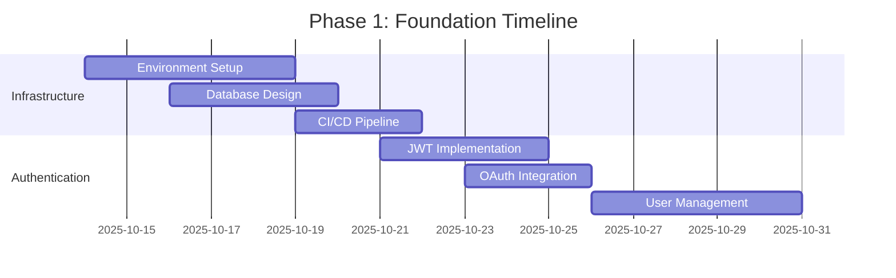
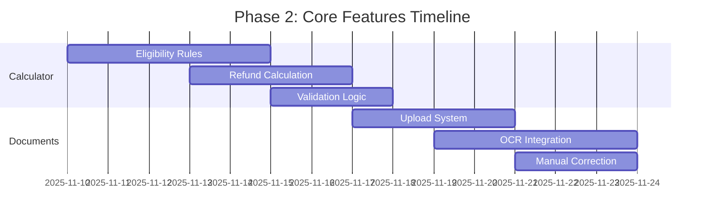
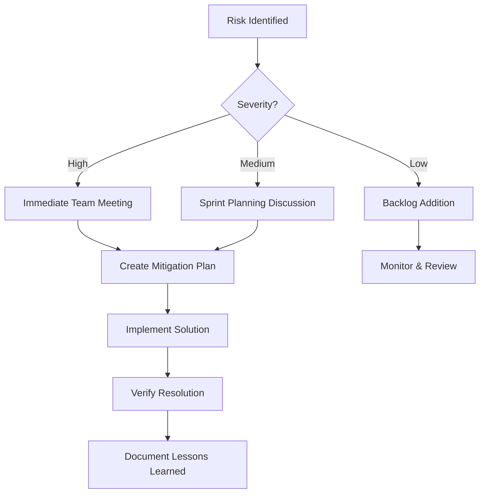
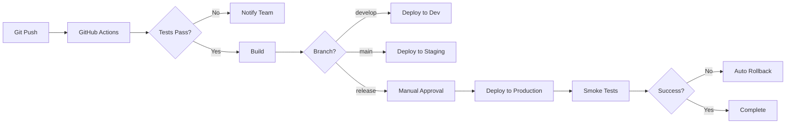

    # VBL Development Plan - Detailed Implementation Strategy
## Foundation Platform for Unified 4-Platform System

**Project:** VBLrefund.com - German Public Service Pension Refund Platform
**Duration:** 20 weeks (400 hours) + holiday buffer
**Budget:** $16,000
**Team Size:** 1 Full-Stack Developer (Philippines-based)
**Methodology:** Agile/Kanban with 1-week iterations
**Start Date:** October 14, 2025 (Tuesday)
**Launch Target:** March 15, 2026 (adjusted for holidays and single developer)

---

## Table of Contents

1. [Executive Summary](#1-executive-summary)
2. [Project Timeline with Philippine Holidays](#2-project-timeline-with-philippine-holidays)
3. [Project Architecture Overview](#3-project-architecture-overview)
4. [Development Phases](#4-development-phases)
5. [Sprint Planning Details](#5-sprint-planning-details)
6. [Technical Implementation](#6-technical-implementation)
7. [Resource Allocation](#7-resource-allocation)
8. [Risk Management](#8-risk-management)
9. [Quality Assurance](#9-quality-assurance)
10. [Deployment Strategy](#10-deployment-strategy)
11. [Success Metrics](#11-success-metrics)

---

## 1. Executive Summary

### 1.1 Project Vision
Build the foundation platform for a unified 4-platform pension refund system, starting with VBLrefund.com as the base that will enable 70-85% code reuse for subsequent platforms (GPR, RPT, DIY).

### 1.2 Core Objectives
- **Primary:** Launch production-ready VBL platform in 18 weeks
- **Secondary:** Establish reusable architecture for 3 additional platforms
- **Technical:** Achieve 80%+ code coverage, <200ms API response times
- **Business:** Process 100+ applications/month with 85% success rate

### 1.3 Key Deliverables
| Deliverable | Description | Timeline |
|-------------|-------------|----------|
| **Infrastructure** | AWS setup, database, CI/CD | Week 4 |
| **Authentication** | User management, OAuth, JWT | Week 4 |
| **Eligibility Engine** | Calculator with pre/post-2018 rules | Week 6 |
| **Document System** | Upload, OCR, validation | Week 8 |
| **Payment Processing** | Stripe integration, VAT, invoicing | Week 10 |
| **Submission System** | Lettershop API, PDF generation | Week 12 |
| **Signature Capture** | Hand-drawn signature matching passport | Week 14 |
| **Admin Dashboard** | Operations management interface | Week 16 |
| **Production Launch** | Deployed and monitored platform | Week 18 |

### 1.4 Strategic Value
- **Foundation Investment:** $16,000 enables $67,200 total system
- **Code Reusability:** 70-85% shared components across platforms
- **Time-to-Market:** 63 weeks for all 4 platforms vs 100+ weeks separate
- **Maintenance Efficiency:** Single codebase reduces costs by 60%

---

## 2. Project Timeline with Philippine Holidays

### 2.1 Philippine Holidays Impact (Oct 2025 - Mar 2026)

| Holiday | Date | Day | Impact on Development |
|---------|------|-----|----------------------|
| **All Saints' Day** | Nov 1, 2025 | Saturday | Weekend |
| **All Souls' Day** | Nov 2, 2025 | Sunday | Weekend |
| **Bonifacio Day** | Nov 30, 2025 | Sunday | Weekend |
| **Immaculate Conception** | Dec 8, 2025 | Monday | No work |
| **Christmas Eve** | Dec 24, 2025 | Wednesday | Half day |
| **Christmas Day** | Dec 25, 2025 | Thursday | No work |
| **Rizal Day** | Dec 30, 2025 | Tuesday | No work |
| **New Year's Eve** | Dec 31, 2025 | Wednesday | Half day |
| **New Year's Day** | Jan 1, 2026 | Thursday | No work |
| **Chinese New Year** | Feb 17, 2026 | Tuesday | No work |
| **EDSA Revolution Day** | Feb 25, 2026 | Wednesday | No work |

**Total Non-Working Days:** 7 full days + 2 half days
**Reduced Productivity Period:** Dec 24 - Jan 3 (Holiday season)

### 2.2 Adjusted Development Schedule (Single Developer)

**Weekly Iterations with Kanban Flow:**

| Phase | Weeks | Dates | Focus Area |
|-------|-------|-------|------------|
| **Phase 1: Foundation** | 1-4 | Oct 14 - Nov 7 | Infrastructure, Database, Auth |
| **Phase 2: Core Features** | 5-8 | Nov 10 - Dec 5 | Calculator, Documents, OCR |
| **Phase 3: Integration** | 9-11 | Dec 8-26 | Payment, Lettershop (Dec 8 off) |
| **Holiday Break** | - | Dec 27 - Jan 4 | Documentation, Planning |
| **Phase 4: Workflow** | 12-15 | Jan 5-30 | Signature, Workflow, Admin |
| **Phase 5: Polish** | 16-18 | Feb 2-20 | Testing, Security (Feb 17 CNY) |
| **Phase 6: Launch** | 19-20 | Feb 23 - Mar 15 | Deployment (Feb 25 EDSA) |

**Single Developer Capacity:**
- 40 hours/week when working
- 20 hours/week during holiday periods
- Total: ~400 hours over 20 weeks

### 2.3 Mitigation Strategies

1. **Front-load Critical Work:** Complete core infrastructure before December holidays
2. **Buffer Time:** Add 2 weeks total buffer for holidays and reduced productivity
3. **Remote Async Work:** Allow flexible hours during holiday periods
4. **Documentation Sprint:** Use Dec 23-Jan 3 for documentation and planning
5. **Optional Weekend Work:** Offer overtime for willing developers

---

## 3. Project Architecture Overview

### 3.1 High-Level Architecture

```
┌─────────────────────────────────────────────────────────────┐
│                   AWS CloudFront CDN                         │
│          (DDoS Protection, Caching, Edge Locations)          │
└────────────────────────┬────────────────────────────────────┘
                         │
┌────────────────────────▼────────────────────────────────────┐
│                  Next.js Frontend                            │
│              (Vercel Edge Network - EU)                      │
│    ┌─────────────┬──────────────┬──────────────┐           │
│    │   Landing   │  Application │     Admin     │           │
│    │    Pages    │   Dashboard  │   Dashboard   │           │
│    └─────────────┴──────────────┴──────────────┘           │
└────────────────────────┬────────────────────────────────────┘
                         │
┌────────────────────────▼────────────────────────────────────┐
│                  AWS API Gateway v2                          │
│              (Rate Limiting, API Management)                 │
└────────────────────────┬────────────────────────────────────┘
                         │
┌────────────────────────▼────────────────────────────────────┐
│                 Hono.js Backend (Lambda)                     │
│  ┌──────────────────────────────────────────────────────┐  │
│  │                  Shared Services (70%)                │  │
│  │  ┌─────────┬──────────┬───────────┬──────────────┐  │  │
│  │  │  Auth   │   User   │  Document │   Signature  │  │  │
│  │  │ System  │   Mgmt   │   Store   │   Capture    │  │  │
│  │  └─────────┴──────────┴───────────┴──────────────┘  │  │
│  └──────────────────────────────────────────────────────┘  │
│  ┌──────────────────────────────────────────────────────┐  │
│  │                VBL-Specific Services (30%)            │  │
│  │  ┌─────────┬──────────┬───────────┬──────────────┐  │  │
│  │  │  VBL    │ Letter-  │  Payment  │   Workflow   │  │  │
│  │  │ Calc    │  shop    │  (Stripe) │   Engine     │  │  │
│  │  └─────────┴──────────┴───────────┴──────────────┘  │  │
│  └──────────────────────────────────────────────────────┘  │
└────────────────────────┬────────────────────────────────────┘
                         │
         ┌───────────────┼───────────────┐
         │               │               │
┌────────▼──────┐ ┌──────▼─────┐ ┌──────▼──────┐
│  PostgreSQL   │ │   Redis    │ │  S3 Bucket  │
│   (RDS EU)    │ │   Cache    │ │  (EU-WEST)  │
└───────────────┘ └────────────┘ └─────────────┘
```

### 2.2 Technology Stack

| Layer | Technology | Version | Justification |
|-------|------------|---------|---------------|
| **Frontend** |
| Framework | Next.js | 14.x | App Router, RSC, SEO |
| Language | TypeScript | 5.x | Type safety, DX |
| Styling | Tailwind CSS | 3.x | Rapid development |
| Forms | React Hook Form | 7.x | Performance, validation |
| State | Zustand | 4.x | Lightweight, simple |
| **Backend** |
| Runtime | Node.js | 20.x LTS | Stability |
| Framework | Hono | 4.x | Serverless-first, fast |
| ORM | Drizzle | Latest | Type-safe, performant, migrations |
| Validation | Zod | 3.x | Schema validation |
| Auth | @hono/oauth-providers | Latest | OAuth2/OIDC support |
| **Database** |
| Production | PostgreSQL | 15.x | JSONB, reliability |
| Local Dev | PostgreSQL (Docker) | 15.x | Consistent environment |
| Cache | Redis | 7.x | Sessions, queues |
| **Infrastructure** |
| Monorepo/IaC | SST | 3.x | TypeScript, integrated monorepo |
| Cloud | AWS | - | EU Frankfurt |
| CDN | AWS CloudFront | - | Integrated with AWS, DDoS protection |
| **Integrations** |
| Payments | Unified Payment Module | - | Multi-provider support |
| OCR | Tesseract | 5.x | Open-source, customizable |
| Email | SendGrid | - | Deliverability |
| Submission | Lettershop API | - | Print & mail |

### 3.2 Folder Structure

```
vbl-unified-platform/              # SST Monorepo Root
├── apps/
│   ├── web/                       # Next.js VBL frontend
│   │   ├── app/                   # App Router pages
│   │   ├── components/            # React components
│   │   ├── lib/                   # Utilities
│   │   └── public/                # Static assets
│   └── admin/                     # Admin dashboard
├── packages/
│   ├── functions/                 # Hono backend (Lambda functions)
│   │   ├── src/
│   │   │   ├── shared/           # Reusable services (70%)
│   │   │   │   ├── auth/         # @hono/oauth-providers
│   │   │   │   ├── users/
│   │   │   │   ├── documents/
│   │   │   │   ├── signature/
│   │   │   │   ├── payments/     # Unified Payment Module
│   │   │   │   └── notifications/
│   │   │   └── vbl/              # VBL-specific (30%)
│   │   │       ├── calculator/
│   │   │       ├── lettershop/
│   │   │       └── workflow/
│   │   └── drizzle/              # Drizzle ORM schemas
│   │       ├── schema/
│   │       └── migrations/
│   ├── core/                      # Shared business logic
│   ├── ui/                        # Shared UI components
│   └── types/                     # TypeScript types
├── sst.config.ts                  # SST configuration
├── docker-compose.yml             # Local PostgreSQL + Redis
└── tests/                         # Test suites
    ├── unit/
    ├── integration/
    └── e2e/
```

---

## 3. Development Phases

### Phase 1: Foundation (Weeks 1-4)
**Goal:** Establish infrastructure and core systems



### Phase 2: Core Features (Weeks 5-8)
**Goal:** Implement VBL-specific business logic



### Phase 3: Integration (Weeks 9-12)
**Goal:** Connect payment and submission systems

### Phase 4: Polish (Weeks 13-16)
**Goal:** Admin tools, testing, security

### Phase 5: Launch (Weeks 17-18)
**Goal:** Production deployment and monitoring

---

## 4. Development Plan for Single Developer with Story Points

### Story Point Guide for Single Developer
| Points | Effort | Description |
|--------|--------|-------------|
| **1** | 2-4 hours | Simple task, minimal complexity |
| **2** | 4-8 hours | Straightforward feature |
| **3** | 1-2 days | Standard feature with some complexity |
| **5** | 2-3 days | Complex feature or integration |
| **8** | 3-5 days | Major feature or complex integration |
| **13** | 1 week+ | Epic-level work |

**Weekly Velocity:** 15-20 story points (single developer)

### Week 1-2: Foundation Setup
**Focus:** Environment, Infrastructure, Database
**Target:** 30 story points

| ID | Task | Story Points | Priority |
|----|------|--------------|----------|
| VBL-001 | Initialize SST v3 monorepo structure | 3 | P0 |
| VBL-002 | Setup Docker PostgreSQL + Redis locally | 2 | P0 |
| VBL-003 | Configure Drizzle ORM with initial schemas | 5 | P0 |
| VBL-004 | Deploy basic AWS infrastructure via SST | 8 | P0 |
| VBL-005 | Create landing page with Next.js | 5 | P0 |
| VBL-006 | Setup GitHub Actions CI/CD | 5 | P0 |
| VBL-007 | Configure local development environment | 2 | P0 |
| **Total** | | **30** | |

**Deliverables:** Working development environment with deployed landing page

### Week 3-4: Authentication System
**Focus:** User Management, OAuth, JWT
**Target:** 32 story points

| ID | Task | Story Points | Priority |
|----|------|--------------|----------|
| VBL-008 | Implement @hono/oauth-providers for Google/Apple | 8 | P0 |
| VBL-009 | Setup JWT authentication and middleware | 5 | P0 |
| VBL-010 | Create user registration/login endpoints | 5 | P0 |
| VBL-011 | Implement email verification with SendGrid | 3 | P0 |
| VBL-012 | Build password reset flow | 3 | P0 |
| VBL-013 | Create user profile management | 3 | P1 |
| VBL-014 | Add authentication UI components | 5 | P0 |
| **Total** | | **32** | |

**Deliverables:** Complete authentication system with OAuth

### Week 5-6: VBL Calculator Engine
**Focus:** Eligibility Rules, Refund Calculation
**Target:** 35 story points

| ID | Task | Story Points | Priority |
|----|------|--------------|----------|
| VBL-015 | Build eligibility calculator with pre/post-2018 rules | 8 | P0 |
| VBL-016 | Implement West Germany employment validation | 5 | P0 |
| VBL-017 | Create refund amount calculation (€89/year + VAT) | 5 | P0 |
| VBL-018 | Build calculator UI with step-by-step form | 8 | P0 |
| VBL-019 | Add detailed explanations for each rule | 3 | P1 |
| VBL-020 | Implement JSON-based rules configuration | 3 | P1 |
| VBL-021 | Write unit tests for calculator logic | 3 | P0 |
| **Total** | | **35** | |

**Deliverables:** Working calculator with accurate calculations

### Week 7-8: Document Management & OCR
**Focus:** File Upload, Tesseract OCR, Data Extraction
**Target:** 38 story points

| ID | Task | Story Points | Priority |
|----|------|--------------|----------|
| VBL-022 | Setup S3 bucket with encryption (EU region) | 3 | P0 |
| VBL-023 | Implement secure file upload with validation | 5 | P0 |
| VBL-024 | Integrate Tesseract OCR with German language | 8 | P0 |
| VBL-025 | Build passport parser with field extraction | 5 | P0 |
| VBL-026 | Build payslip parser for VBL contributions | 5 | P0 |
| VBL-027 | Build VBL letter parser | 3 | P0 |
| VBL-028 | Create manual OCR correction UI | 5 | P0 |
| VBL-029 | Add virus scanning with ClamAV | 2 | P1 |
| VBL-030 | Implement document preview component | 2 | P1 |
| **Total** | | **38** | |

**Deliverables:** Document processing system with OCR

### Week 9-11: Payment & Submission Integration
**Focus:** Unified Payment Module, Lettershop API
**Target:** 45 story points

| ID | Task | Story Points | Priority |
|----|------|--------------|----------|
| **Week 9-10: Payment Processing** | | | |
| VBL-031 | Setup Unified Payment Module architecture | 5 | P0 |
| VBL-032 | Integrate Stripe payment provider | 5 | P0 |
| VBL-033 | Implement VAT calculation (19%) | 3 | P0 |
| VBL-034 | Create invoice generation with PDF | 5 | P0 |
| VBL-035 | Setup Stripe webhooks handling | 3 | P0 |
| VBL-036 | Build payment UI with Stripe Elements | 5 | P0 |
| VBL-037 | Add refund capability | 3 | P1 |
| **Week 11: Lettershop Integration** | | | |
| VBL-038 | Generate VBL application PDFs | 5 | P0 |
| VBL-039 | Integrate Lettershop submission API | 5 | P0 |
| VBL-040 | Implement idempotency for submissions | 2 | P0 |
| VBL-041 | Add submission tracking system | 2 | P0 |
| VBL-042 | Setup Lettershop status webhooks | 2 | P0 |
| **Total** | | **45** | |

**Deliverables:** Complete payment and submission system

### Week 12-15: Workflow & Admin Features
**Focus:** Signature Capture, Workflow Engine, Admin Dashboard
**Target:** 52 story points

| ID | Task | Story Points | Priority |
|----|------|--------------|----------|
| **Week 12-13: Workflow & Signature** | | | |
| VBL-043 | Build signature capture canvas component | 5 | P0 |
| VBL-044 | Validate signature matches passport | 3 | P0 |
| VBL-045 | Apply signatures to PDF documents | 3 | P0 |
| VBL-046 | Implement 5-step workflow state machine | 8 | P0 |
| VBL-047 | Create workflow progress UI component | 5 | P0 |
| VBL-048 | Add comprehensive audit logging | 3 | P1 |
| VBL-049 | Build workflow notification system | 2 | P1 |
| **Week 14-15: Admin Dashboard** | | | |
| VBL-050 | Setup admin authentication & roles | 3 | P0 |
| VBL-051 | Build admin dashboard layout | 5 | P0 |
| VBL-052 | Create application management interface | 5 | P0 |
| VBL-053 | Add user management features | 3 | P0 |
| VBL-054 | Implement analytics dashboard | 5 | P1 |
| VBL-055 | Add CSV/PDF export functionality | 2 | P1 |
| **Total** | | **52** | |

**Deliverables:** Complete workflow and admin system

### Week 16-18: Testing & Security
**Focus:** E2E Testing, Security Audit, Performance
**Target:** 40 story points

| ID | Task | Story Points | Priority |
|----|------|--------------|----------|
| VBL-056 | Write E2E tests for critical user flows | 8 | P0 |
| VBL-057 | Conduct OWASP Top 10 security audit | 5 | P0 |
| VBL-058 | Perform load testing with K6 (100 users) | 3 | P0 |
| VBL-059 | Fix identified critical bugs | 8 | P0 |
| VBL-060 | Optimize database queries and indexes | 3 | P0 |
| VBL-061 | Setup CloudWatch monitoring & alerts | 3 | P0 |
| VBL-062 | Write user documentation | 5 | P1 |
| VBL-063 | Create API documentation | 3 | P1 |
| VBL-064 | Setup error tracking with Sentry | 2 | P1 |
| **Total** | | **40** | |

**Deliverables:** Production-ready system with tests

### Week 19-20: Deployment & Launch
**Focus:** Production Setup, Monitoring, Soft Launch
**Target:** 25 story points

| ID | Task | Story Points | Priority |
|----|------|--------------|----------|
| VBL-065 | Deploy to production environment | 5 | P0 |
| VBL-066 | Configure CloudFront CDN with caching | 3 | P0 |
| VBL-067 | Setup WAF rules for DDoS protection | 3 | P0 |
| VBL-068 | Configure production monitoring & alerts | 3 | P0 |
| VBL-069 | Conduct soft launch with 10 beta users | 3 | P0 |
| VBL-070 | Monitor and fix production issues | 5 | P0 |
| VBL-071 | Gradual rollout to 50 users | 3 | P0 |
| **Total** | | **25** | |

**Deliverables:** Live production system

### Total Project Story Points Summary

| Phase | Weeks | Story Points | Average/Week |
|-------|-------|--------------|--------------|
| Foundation | 1-2 | 30 | 15 |
| Authentication | 3-4 | 32 | 16 |
| Calculator | 5-6 | 35 | 17.5 |
| Documents & OCR | 7-8 | 38 | 19 |
| Payment & Submission | 9-11 | 45 | 15 |
| Workflow & Admin | 12-15 | 52 | 13 |
| Testing & Security | 16-18 | 40 | 13.3 |
| Deployment | 19-20 | 25 | 12.5 |
| **Total** | **20** | **297** | **14.85** |

**Note:** Holiday periods (Dec 24-Jan 3) will have reduced velocity, compensated by higher productivity in other weeks with AI assistance.

---

## 5. Technical Implementation

### 5.1 Local Development Environment

**Docker Configuration for PostgreSQL + Redis:**
```yaml
# docker-compose.yml
version: '3.8'

services:
  postgres:
    image: postgres:15-alpine
    container_name: vbl-postgres
    environment:
      POSTGRES_USER: vbl_user
      POSTGRES_PASSWORD: vbl_password
      POSTGRES_DB: vbl_development
    ports:
      - "5432:5432"
    volumes:
      - postgres_data:/var/lib/postgresql/data
      - ./scripts/init.sql:/docker-entrypoint-initdb.d/init.sql
    healthcheck:
      test: ["CMD-SHELL", "pg_isready -U vbl_user -d vbl_development"]
      interval: 10s
      timeout: 5s
      retries: 5

  redis:
    image: redis:7-alpine
    container_name: vbl-redis
    ports:
      - "6379:6379"
    volumes:
      - redis_data:/data
    healthcheck:
      test: ["CMD", "redis-cli", "ping"]
      interval: 10s
      timeout: 5s
      retries: 5

volumes:
  postgres_data:
  redis_data:
```

### 5.2 Database Schema with Drizzle ORM

**Drizzle Schema Definition:**
```typescript
// packages/functions/drizzle/schema/shared.ts
import { pgSchema, uuid, varchar, boolean, timestamp, jsonb, text, integer, decimal, date } from 'drizzle-orm/pg-core';
import { relations } from 'drizzle-orm';

export const shared = pgSchema('shared');

export const users = shared.table('users', {
  id: uuid('id').defaultRandom().primaryKey(),
  email: varchar('email', { length: 255 }).unique().notNull(),
  emailVerified: boolean('email_verified').default(false),
  passwordHash: varchar('password_hash', { length: 255 }),
  authProvider: varchar('auth_provider', { length: 50 }),
  authProviderId: varchar('auth_provider_id', { length: 255 }),
  createdAt: timestamp('created_at', { withTimezone: true }).defaultNow(),
  updatedAt: timestamp('updated_at', { withTimezone: true }).defaultNow(),
  deletedAt: timestamp('deleted_at', { withTimezone: true }),
});

export const profiles = shared.table('profiles', {
  id: uuid('id').defaultRandom().primaryKey(),
  userId: uuid('user_id').notNull().references(() => users.id),
  firstName: varchar('first_name', { length: 100 }).notNull(),
  lastName: varchar('last_name', { length: 100 }).notNull(),
  dateOfBirth: date('date_of_birth'),
  nationality: varchar('nationality', { length: 2 }),
  phone: varchar('phone', { length: 20 }),
  addressLine1: varchar('address_line1', { length: 255 }),
  addressLine2: varchar('address_line2', { length: 255 }),
  city: varchar('city', { length: 100 }),
  postalCode: varchar('postal_code', { length: 20 }),
  country: varchar('country', { length: 2 }),
  metadata: jsonb('metadata').default({}),
});

export const documents = shared.table('documents', {
  id: uuid('id').defaultRandom().primaryKey(),
  userId: uuid('user_id').notNull().references(() => users.id),
  fileName: varchar('file_name', { length: 255 }).notNull(),
  fileType: varchar('file_type', { length: 50 }).notNull(),
  fileSize: integer('file_size').notNull(),
  s3Key: varchar('s3_key', { length: 500 }).notNull(),
  ocrData: jsonb('ocr_data'),
  ocrConfidence: decimal('ocr_confidence', { precision: 3, scale: 2 }),
  status: varchar('status', { length: 50 }).default('pending'),
  createdAt: timestamp('created_at', { withTimezone: true }).defaultNow(),
});

export const signatures = shared.table('signatures', {
  id: uuid('id').defaultRandom().primaryKey(),
  userId: uuid('user_id').notNull().references(() => users.id),
  signatureData: text('signature_data').notNull(), // Base64 encoded
  createdAt: timestamp('created_at', { withTimezone: true }).defaultNow(),
  isActive: boolean('is_active').default(true),
});

// Relations
export const usersRelations = relations(users, ({ one, many }) => ({
  profile: one(profiles),
  documents: many(documents),
  signatures: many(signatures),
}));
```

**VBL-Specific Schema:**
```typescript
// packages/functions/drizzle/schema/vbl.ts
import { pgSchema, uuid, varchar, boolean, timestamp, jsonb, decimal, date, integer } from 'drizzle-orm/pg-core';
import { users } from './shared';

export const vbl = pgSchema('vbl');

export const applications = vbl.table('applications', {
  id: uuid('id').defaultRandom().primaryKey(),
  userId: uuid('user_id').notNull().references(() => users.id),
  status: varchar('status', { length: 50 }).default('draft'),

  // Employment data
  employerName: varchar('employer_name', { length: 255 }),
  employmentStart: date('employment_start'),
  employmentEnd: date('employment_end'),
  isWestGermany: boolean('is_west_germany'),
  monthsContributed: integer('months_contributed'),
  vblInsuranceNumber: varchar('vbl_insurance_number', { length: 50 }),

  // Calculation
  calculationMethod: varchar('calculation_method', { length: 20 }), // 'pre2018' or 'post2018'
  baseRefundAmount: decimal('base_refund_amount', { precision: 10, scale: 2 }),
  vatAmount: decimal('vat_amount', { precision: 10, scale: 2 }),
  totalAmount: decimal('total_amount', { precision: 10, scale: 2 }),

  // Payment
  paymentStatus: varchar('payment_status', { length: 50 }).default('pending'),
  stripePaymentId: varchar('stripe_payment_id', { length: 255 }),
  invoiceNumber: varchar('invoice_number', { length: 50 }),
  paidAt: timestamp('paid_at', { withTimezone: true }),

  // Submission
  lettershopSubmissionId: varchar('lettershop_submission_id', { length: 255 }),
  submittedAt: timestamp('submitted_at', { withTimezone: true }),
  pdfS3Key: varchar('pdf_s3_key', { length: 500 }),

  // Workflow
  workflowState: varchar('workflow_state', { length: 50 }).default('draft'),
  workflowHistory: jsonb('workflow_history').default([]),

  createdAt: timestamp('created_at', { withTimezone: true }).defaultNow(),
  updatedAt: timestamp('updated_at', { withTimezone: true }).defaultNow(),
});
```

### 5.3 Original SQL Schema (Reference)

```sql
-- Shared schema (reusable across platforms)
CREATE SCHEMA shared;

CREATE TABLE shared.users (
    id UUID PRIMARY KEY DEFAULT gen_random_uuid(),
    email VARCHAR(255) UNIQUE NOT NULL,
    email_verified BOOLEAN DEFAULT false,
    password_hash VARCHAR(255),
    auth_provider VARCHAR(50),
    auth_provider_id VARCHAR(255),
    created_at TIMESTAMPTZ DEFAULT NOW(),
    updated_at TIMESTAMPTZ DEFAULT NOW(),
    deleted_at TIMESTAMPTZ
);

CREATE TABLE shared.profiles (
    id UUID PRIMARY KEY DEFAULT gen_random_uuid(),
    user_id UUID NOT NULL REFERENCES shared.users(id),
    first_name VARCHAR(100) NOT NULL,
    last_name VARCHAR(100) NOT NULL,
    date_of_birth DATE,
    nationality VARCHAR(2),
    phone VARCHAR(20),
    address_line1 VARCHAR(255),
    address_line2 VARCHAR(255),
    city VARCHAR(100),
    postal_code VARCHAR(20),
    country VARCHAR(2),
    metadata JSONB DEFAULT '{}'
);

CREATE TABLE shared.documents (
    id UUID PRIMARY KEY DEFAULT gen_random_uuid(),
    user_id UUID NOT NULL REFERENCES shared.users(id),
    file_name VARCHAR(255) NOT NULL,
    file_type VARCHAR(50) NOT NULL,
    file_size INTEGER NOT NULL,
    s3_key VARCHAR(500) NOT NULL,
    ocr_data JSONB,
    ocr_confidence DECIMAL(3,2),
    status VARCHAR(50) DEFAULT 'pending',
    created_at TIMESTAMPTZ DEFAULT NOW()
);

CREATE TABLE shared.signatures (
    id UUID PRIMARY KEY DEFAULT gen_random_uuid(),
    user_id UUID NOT NULL REFERENCES shared.users(id),
    signature_data TEXT NOT NULL, -- Base64 encoded image
    created_at TIMESTAMPTZ DEFAULT NOW(),
    is_active BOOLEAN DEFAULT true
);

-- VBL-specific schema
CREATE SCHEMA vbl;

CREATE TABLE vbl.applications (
    id UUID PRIMARY KEY DEFAULT gen_random_uuid(),
    user_id UUID NOT NULL REFERENCES shared.users(id),
    status VARCHAR(50) DEFAULT 'draft',

    -- Employment data
    employer_name VARCHAR(255),
    employment_start DATE,
    employment_end DATE,
    is_west_germany BOOLEAN,
    months_contributed INTEGER,
    vbl_insurance_number VARCHAR(50),

    -- Calculation
    calculation_method VARCHAR(20), -- 'pre2018' or 'post2018'
    base_refund_amount DECIMAL(10,2),
    vat_amount DECIMAL(10,2),
    total_amount DECIMAL(10,2),

    -- Payment
    payment_status VARCHAR(50) DEFAULT 'pending',
    stripe_payment_id VARCHAR(255),
    invoice_number VARCHAR(50),
    paid_at TIMESTAMPTZ,

    -- Submission
    lettershop_submission_id VARCHAR(255),
    submitted_at TIMESTAMPTZ,
    pdf_s3_key VARCHAR(500),

    -- Workflow
    workflow_state VARCHAR(50) DEFAULT 'draft',
    workflow_history JSONB DEFAULT '[]',

    created_at TIMESTAMPTZ DEFAULT NOW(),
    updated_at TIMESTAMPTZ DEFAULT NOW()
);

CREATE TABLE vbl.calculation_logs (
    id UUID PRIMARY KEY DEFAULT gen_random_uuid(),
    application_id UUID REFERENCES vbl.applications(id),
    input_data JSONB NOT NULL,
    rules_version VARCHAR(20),
    calculation_result JSONB NOT NULL,
    created_at TIMESTAMPTZ DEFAULT NOW()
);

-- Indexes for performance
CREATE INDEX idx_users_email ON shared.users(email);
CREATE INDEX idx_documents_user_status ON shared.documents(user_id, status);
CREATE INDEX idx_applications_user_status ON vbl.applications(user_id, status);
CREATE INDEX idx_applications_workflow ON vbl.applications(workflow_state);
```

### 5.2 Tesseract OCR Implementation

**OCR Service Architecture:**
```typescript
// packages/functions/src/shared/ocr/tesseract-service.ts
import Tesseract from 'tesseract.js';
import sharp from 'sharp';

export class TesseractOCRService {
  private worker: Tesseract.Worker;

  async initialize() {
    this.worker = await Tesseract.createWorker({
      langPath: './tessdata',
      logger: m => console.log(m),
    });

    // Load German and English language models
    await this.worker.loadLanguage('deu+eng');
    await this.worker.initialize('deu+eng');
  }

  async preprocessImage(imageBuffer: Buffer): Promise<Buffer> {
    // Image enhancement for better OCR accuracy
    return await sharp(imageBuffer)
      .grayscale()
      .normalize()
      .sharpen()
      .threshold(128)
      .toBuffer();
  }

  async extractText(imageBuffer: Buffer, documentType: string) {
    const processedImage = await this.preprocessImage(imageBuffer);

    const { data: { text, confidence, blocks } } = await this.worker.recognize(processedImage);

    // Document-specific parsing
    switch(documentType) {
      case 'passport':
        return this.parsePassport(text, blocks);
      case 'payslip':
        return this.parsePayslip(text, blocks);
      case 'vbl_letter':
        return this.parseVBLLetter(text, blocks);
      default:
        return { text, confidence, blocks };
    }
  }

  private parsePassport(text: string, blocks: any) {
    // Extract passport-specific fields
    return {
      documentNumber: this.extractPattern(text, /[A-Z0-9]{9}/),
      firstName: this.extractField(blocks, 'Given Names'),
      lastName: this.extractField(blocks, 'Surname'),
      dateOfBirth: this.extractDate(text),
      nationality: this.extractField(blocks, 'Nationality'),
      confidence: blocks.reduce((acc, b) => acc + b.confidence, 0) / blocks.length
    };
  }

  private parsePayslip(text: string, blocks: any) {
    // Extract payslip-specific fields
    return {
      employerName: this.extractField(blocks, 'Arbeitgeber'),
      employeeNumber: this.extractPattern(text, /\d{5,10}/),
      grossSalary: this.extractAmount(text, 'Brutto'),
      period: this.extractPeriod(text),
      vblContribution: this.extractAmount(text, 'VBL'),
      confidence: blocks.reduce((acc, b) => acc + b.confidence, 0) / blocks.length
    };
  }

  async cleanup() {
    await this.worker.terminate();
  }
}
```

**Key Benefits of Tesseract over AWS Textract:**
1. **No API costs** - Completely free and open-source
2. **Data privacy** - All processing done locally, no data leaves your servers
3. **Customizable** - Can train custom models for German pension documents
4. **Offline capability** - No dependency on external services
5. **GDPR compliant** - EU data never leaves EU infrastructure

**Training Custom Models for German Documents:**
```bash
# Training workflow for improved accuracy
tesseract vbl_training_data.tif vbl_training_data -l deu --psm 6 lstm.train
combine_tessdata -u tessdata/deu.traineddata deu.
unicharset_extractor vbl_training_data.box
mftraining -F font_properties -U unicharset -O deu.unicharset vbl_training_data.tr
```

### 5.3 CloudFront CDN Configuration

**CloudFront Setup with SST:**
```typescript
// sst.config.ts
import { SSTConfig } from "sst";
import { NextjsSite, Api } from "sst/constructs";

export default {
  config(_input) {
    return {
      name: "vbl-unified-platform",
      region: "eu-central-1", // Frankfurt
    };
  },
  stacks(app) {
    app.stack(function Site({ stack }) {
      // Frontend with CloudFront
      const site = new NextjsSite(stack, "VBLFrontend", {
        path: "apps/web",
        customDomain: {
          domainName: "vblrefund.com",
          hostedZone: "vblrefund.com",
        },
        environment: {
          NEXT_PUBLIC_API_URL: api.url,
        },
        // CloudFront configuration
        cdk: {
          distribution: {
            defaultBehavior: {
              viewerProtocolPolicy: "redirect-to-https",
              compress: true,
              cachePolicy: {
                defaultTtl: 86400, // 24 hours
                maxTtl: 31536000, // 1 year
                minTtl: 0,
              },
            },
            // Enable AWS Shield Standard (free DDoS protection)
            webAclId: waf.attrArn,
            // Cache behaviors for static assets
            additionalBehaviors: {
              "/_next/static/*": {
                viewerProtocolPolicy: "https-only",
                compress: true,
                cachePolicy: {
                  defaultTtl: 31536000, // 1 year for static assets
                },
              },
              "/api/*": {
                viewerProtocolPolicy: "https-only",
                cachePolicy: {
                  defaultTtl: 0, // No caching for API routes
                },
              },
            },
            priceClass: "PriceClass_100", // Use only NA and EU edge locations
            geoRestriction: {
              restrictionType: "whitelist",
              locations: ["DE", "AT", "CH", "NL", "BE", "LU", "FR", "IT", "ES", "PH"],
            },
          },
        },
      });

      // WAF for additional DDoS protection
      const waf = new CfnWebACL(stack, "WebACL", {
        defaultAction: { allow: {} },
        rules: [
          {
            name: "RateLimitRule",
            priority: 1,
            statement: {
              rateBasedStatement: {
                limit: 2000, // requests per 5 minutes
                aggregateKeyType: "IP",
              },
            },
            action: { block: {} },
          },
          {
            name: "GeoBlockRule",
            priority: 2,
            statement: {
              geoMatchStatement: {
                countryCodes: ["CN", "RU", "KP"], // Block high-risk countries
              },
            },
            action: { block: {} },
          },
        ],
      });
    });
  },
} satisfies SSTConfig;
```

**CloudFront Benefits for VBL:**
1. **Native AWS Integration** - Seamless with Lambda@Edge, S3, API Gateway
2. **AWS Shield Standard** - Free DDoS protection included
3. **Edge Locations** - 450+ global points of presence
4. **Cost-Effective** - Pay only for data transfer, no minimum fees
5. **Lambda@Edge** - Run code at edge locations for personalization
6. **Real-time Metrics** - CloudWatch integration for monitoring

### 5.4 API Endpoints

```yaml
# Authentication Endpoints
POST   /api/auth/register
POST   /api/auth/login
POST   /api/auth/logout
POST   /api/auth/refresh
POST   /api/auth/forgot-password
POST   /api/auth/reset-password
POST   /api/auth/verify-email
GET    /api/auth/oauth/google
GET    /api/auth/oauth/apple

# User Management
GET    /api/users/me
PUT    /api/users/me
DELETE /api/users/me
PUT    /api/users/me/password

# VBL Calculator
POST   /api/vbl/eligibility/check
POST   /api/vbl/calculate/refund
GET    /api/vbl/rules/current

# Document Management
POST   /api/documents/upload
GET    /api/documents/{id}
DELETE /api/documents/{id}
POST   /api/documents/{id}/ocr
PUT    /api/documents/{id}/ocr-correction

# Signature
POST   /api/signatures/capture
GET    /api/signatures/current
POST   /api/signatures/validate

# Applications
POST   /api/applications
GET    /api/applications
GET    /api/applications/{id}
PUT    /api/applications/{id}
DELETE /api/applications/{id}
POST   /api/applications/{id}/submit
GET    /api/applications/{id}/status

# Payment
POST   /api/payments/create-intent
POST   /api/payments/confirm
GET    /api/payments/{id}/invoice
POST   /api/webhooks/stripe

# Lettershop
POST   /api/lettershop/submit
GET    /api/lettershop/status/{id}
POST   /api/webhooks/lettershop

# Admin
GET    /api/admin/applications
GET    /api/admin/applications/{id}
PUT    /api/admin/applications/{id}/status
GET    /api/admin/users
GET    /api/admin/analytics
POST   /api/admin/reports/export
```

### 5.3 Security Implementation

```typescript
// Security Middleware Stack
import { Hono } from 'hono';
import { cors } from 'hono/cors';
import { csrf } from 'hono/csrf';
import { secureHeaders } from 'hono/secure-headers';
import { rateLimiter } from './middleware/rate-limiter';
import { authenticate } from './middleware/auth';

const app = new Hono();

// Security headers
app.use('*', secureHeaders({
  contentSecurityPolicy: {
    directives: {
      defaultSrc: ["'self'"],
      scriptSrc: ["'self'", "'unsafe-inline'"],
      styleSrc: ["'self'", "'unsafe-inline'"],
      imgSrc: ["'self'", 'data:', 'https:'],
    }
  },
  xFrameOptions: 'DENY',
  xContentTypeOptions: 'nosniff',
}));

// CORS configuration
app.use('*', cors({
  origin: process.env.FRONTEND_URL,
  credentials: true,
}));

// CSRF protection
app.use('*', csrf());

// Rate limiting
app.use('*', rateLimiter({
  windowMs: 15 * 60 * 1000, // 15 minutes
  max: 100, // limit each IP to 100 requests per windowMs
}));

// Authentication for protected routes
app.use('/api/*', authenticate());
```

---

## 6. Resource Allocation

### 6.1 Single Developer Profile

| Aspect | Details |
|--------|---------|
| **Role** | Full-Stack Developer |
| **Location** | Philippines |
| **Hours/Week** | 40 hours (full-time) |
| **Total Duration** | 20 weeks |
| **Total Hours** | 400 hours |
| **Hourly Rate** | $40/hour |
| **Total Cost** | $16,000 |

**AI-Assisted Development:** Using Cursor Pro+ for 2-3x productivity boost

### 6.2 Weekly Capacity Planning

```yaml
Weekly Allocation:
  Development: 32 hours (80%)
  Testing/QA: 4 hours (10%)
  Documentation: 2 hours (5%)
  Planning/Review: 2 hours (5%)

Holiday Periods:
  Regular Week: 40 hours
  Holiday Week: 20-30 hours
  Dec 24-Jan 3: 20 hours total

Productivity Factors:
  - AI assistance: +50-100% speed
  - Single developer: No coordination overhead
  - Focused work: Higher efficiency
  - Learning curve: Weeks 1-2 slower
```

### 6.3 Budget Breakdown

| Category | Amount | Percentage |
|----------|--------|------------|
| **Development** | $14,400 | 90% |
| **Testing/QA** | $800 | 5% |
| **Documentation** | $400 | 2.5% |
| **Buffer/Contingency** | $400 | 2.5% |
| **Total** | $16,000 | 100% |

---

## 7. Risk Management

### 7.1 Risk Matrix

| Risk | Probability | Impact | Mitigation Strategy |
|------|------------|--------|-------------------|
| **Single Developer Illness/Unavailability** | High | Critical | Documentation, code comments, weekly backups, handover plan |
| **Knowledge Bottleneck** | High | High | Comprehensive documentation, recorded decisions, clear code |
| **Burnout Risk** | Medium | High | Regular breaks, realistic deadlines, flexible schedule |
| **OCR Accuracy Issues** | Medium | High | Tesseract training, manual correction UI, fallback options |
| **Lettershop API Downtime** | Low | High | Queue system with retry logic, offline capability |
| **Payment Processing Failures** | Low | Medium | Unified Payment Module, retry mechanisms |
| **GDPR Compliance Issues** | Low | High | Legal templates, data encryption, audit trails |
| **Scope Creep** | High | High | Written requirements, change control, MVP focus |
| **Technical Debt** | Medium | Medium | Weekly refactoring time, code reviews with AI |
| **Security Vulnerabilities** | Medium | High | Automated scanning, OWASP checklist, regular updates |

### 7.2 Contingency Plans



---

## 8. Quality Assurance

### 8.1 Testing Strategy

| Test Type | Coverage Target | Tools | When |
|-----------|----------------|-------|------|
| **Unit Tests** | >80% | Jest, Vitest | Every commit |
| **Integration Tests** | >70% | Supertest | Daily |
| **E2E Tests** | Critical paths | Playwright | Sprint end |
| **Load Tests** | 1000 users | K6 | Pre-release |
| **Security Tests** | OWASP Top 10 | Snyk, OWASP ZAP | Weekly |
| **Accessibility** | WCAG 2.1 AA | axe-core | Sprint end |

### 8.2 Code Quality Standards

```yaml
Code Review Checklist:
  - [ ] Follows TypeScript strict mode
  - [ ] No any types without justification
  - [ ] Proper error handling
  - [ ] Input validation with Zod
  - [ ] Unit tests written
  - [ ] Documentation updated
  - [ ] No security vulnerabilities
  - [ ] Performance considered
  - [ ] GDPR compliance checked

Automated Checks:
  - ESLint with strict rules
  - Prettier formatting
  - TypeScript compilation
  - Test coverage >80%
  - Bundle size analysis
  - Dependency vulnerability scan
```

### 8.3 Performance Criteria

| Metric | Target | Measurement |
|--------|--------|-------------|
| **API Response Time** | <200ms p95 | CloudWatch |
| **Page Load Time** | <2s | Lighthouse |
| **Time to Interactive** | <3s | Web Vitals |
| **Error Rate** | <0.1% | Sentry |
| **Uptime** | 99.9% | UptimeRobot |
| **OCR Processing** | <5s | Custom metrics |

---

## 9. Deployment Strategy

### 9.1 Environment Strategy

```yaml
Environments:
  Development:
    - URL: dev.vblrefund.com
    - Database: PostgreSQL (local/Docker)
    - Auto-deploy: On commit to develop branch

  Staging:
    - URL: staging.vblrefund.com
    - Database: PostgreSQL (AWS RDS)
    - Auto-deploy: On PR merge to main

  Production:
    - URL: vblrefund.com
    - Database: PostgreSQL (AWS RDS with replica)
    - Deploy: Manual approval required
    - Rollback: Automatic on error rate >1%
```

### 9.2 CI/CD Pipeline



### 9.3 Deployment Checklist

**Pre-Deployment:**
- [ ] All tests passing
- [ ] Security scan completed
- [ ] Database migrations tested
- [ ] Environment variables configured
- [ ] SSL certificates valid
- [ ] CDN cache cleared
- [ ] Monitoring alerts configured

**Deployment:**
- [ ] Database backup created
- [ ] Maintenance page enabled
- [ ] Deploy backend services
- [ ] Run database migrations
- [ ] Deploy frontend
- [ ] Smoke tests passed
- [ ] Maintenance page disabled

**Post-Deployment:**
- [ ] Monitor error rates
- [ ] Check performance metrics
- [ ] Verify critical user flows
- [ ] Update status page
- [ ] Notify stakeholders
- [ ] Document any issues

---

## 10. Success Metrics

### 10.1 Development KPIs

| Metric | Target | Measurement Period |
|--------|--------|-------------------|
| **Sprint Velocity** | 40 points | Per sprint |
| **Bug Escape Rate** | <5% | Per release |
| **Code Coverage** | >80% | Continuous |
| **Technical Debt** | <10% | Monthly |
| **Deployment Frequency** | 2/week | Weekly average |
| **Lead Time** | <2 days | Story to production |
| **MTTR** | <1 hour | When incidents occur |

### 10.2 Business Metrics

| Metric | Month 1 | Month 3 | Month 6 |
|--------|---------|---------|---------|
| **Active Users** | 50 | 200 | 500 |
| **Applications/Month** | 20 | 100 | 250 |
| **Success Rate** | 70% | 80% | 85% |
| **Processing Time** | 48h | 24h | 12h |
| **User Satisfaction** | 4.0 | 4.3 | 4.5 |
| **Revenue** | €2k | €10k | €25k |

### 10.3 Platform Health Dashboard

```yaml
Real-time Monitoring:
  Infrastructure:
    - CPU utilization <70%
    - Memory usage <80%
    - Database connections <100
    - Queue depth <1000

  Application:
    - Request rate
    - Error rate <0.1%
    - Response time p50/p95/p99
    - Active sessions

  Business:
    - Applications in progress
    - Daily signups
    - Conversion rate
    - Payment success rate

  Alerts:
    - Error rate >1% (Critical)
    - Response time >500ms (Warning)
    - Payment failures >5% (Critical)
    - Queue backup >1000 (Warning)
```

---

## Appendices

### A. Technology Decisions

| Decision | Choice | Rationale |
|----------|--------|-----------|
| **Monorepo** | Turborepo | Speed, caching, TypeScript |
| **Frontend Framework** | Next.js 14 | App Router, RSC, SEO |
| **Backend Framework** | Hono | Serverless-first, lightweight |
| **Database** | PostgreSQL | JSONB, reliability, ACID |
| **ORM** | Prisma | Type-safety, migrations |
| **Infrastructure** | SST v3 | TypeScript IaC, fast iteration |
| **Payment** | Stripe | EU presence, reliability |
| **OCR** | Tesseract | Open-source, trainable |

### B. Reusability Matrix

| Component | VBL | GPR | RPT | DIY | Reuse % |
|-----------|-----|-----|-----|-----|---------|
| Authentication | ✓ | ✓ | ✓ | ✓ | 100% |
| User Management | ✓ | ✓ | ✓ | ✓ | 100% |
| Document Upload | ✓ | ✓ | ✓ | ✓ | 100% |
| OCR Processing | ✓ | ✓ | ✓ | ✓ | 100% |
| Signature System | ✓ | ✓ | ✓ | ✓ | 100% |
| Payment Base | ✓ | Mod | Mod | ✓ | 75% |
| Notification | ✓ | ✓ | ✓ | ✓ | 100% |
| Admin Dashboard | ✓ | Ext | Ext | Sim | 70% |
| Calculator | ✓ | New | New | ✓ | 25% |
| Workflow | ✓ | New | New | Sim | 40% |

### C. Development Tools

```yaml
Required Tools:
  IDE:
    - VS Code / Cursor Pro+
    - Extensions: ESLint, Prettier, Prisma

  Development:
    - Node.js 20.x LTS
    - pnpm 8.x
    - Docker Desktop
    - AWS CLI
    - PostgreSQL client

  Testing:
    - Postman / Insomnia
    - Playwright Test Runner
    - K6 for load testing

  Monitoring:
    - Sentry account
    - CloudWatch access
    - Datadog (optional)
```

### D. Learning Resources

| Topic | Resource | Priority |
|-------|----------|----------|
| **Next.js 14** | Official docs, App Router guide | P0 |
| **Hono** | hono.dev documentation | P0 |
| **SST v3** | sst.dev guide | P0 |
| **Prisma** | prisma.io tutorials | P0 |
| **AWS Lambda** | Serverless patterns | P1 |
| **PostgreSQL** | JSON operations guide | P1 |
| **TypeScript** | Advanced types | P2 |

---

## Document Control

**Version:** 1.0
**Last Updated:** [Current Date]
**Next Review:** End of Sprint 2
**Owner:** Technical Lead
**Approvers:** Project Sponsor, Product Owner

### Revision History

| Version | Date | Author | Changes |
|---------|------|--------|---------|
| 1.0 | [Date] | [Author] | Initial comprehensive plan |

---

*This document serves as the living blueprint for VBL platform development. It will be updated throughout the project to reflect learnings and adjustments.*